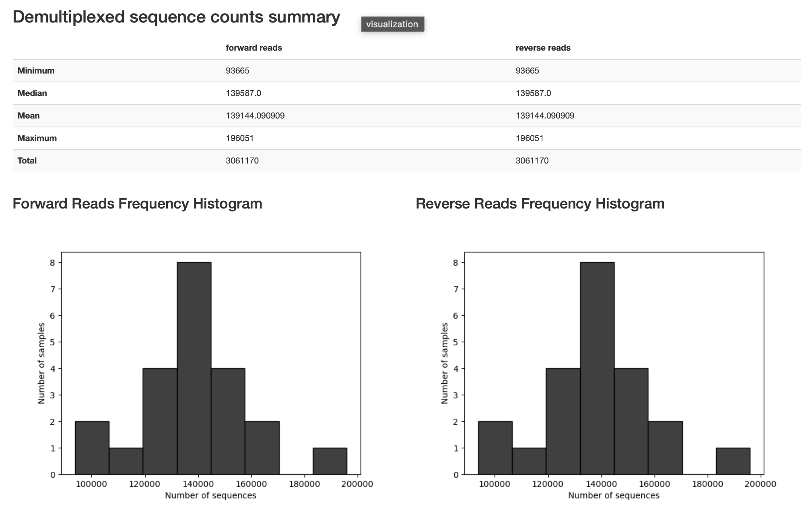
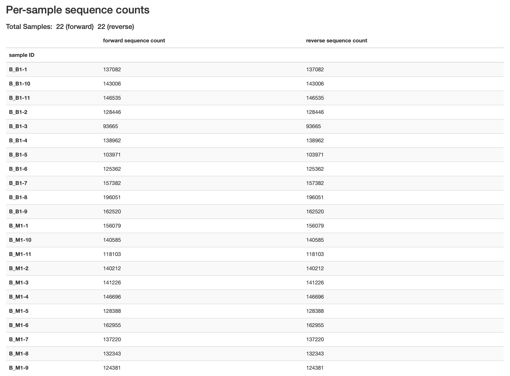
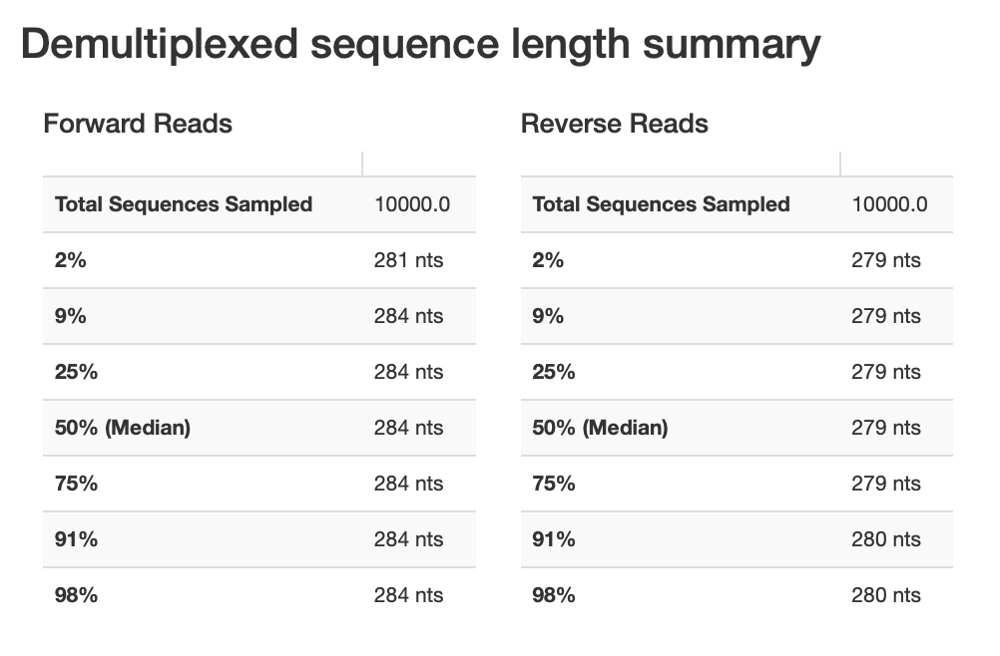
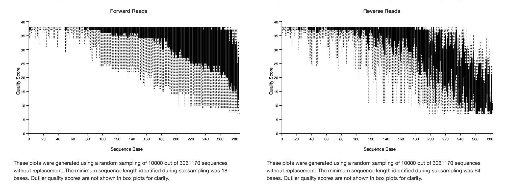
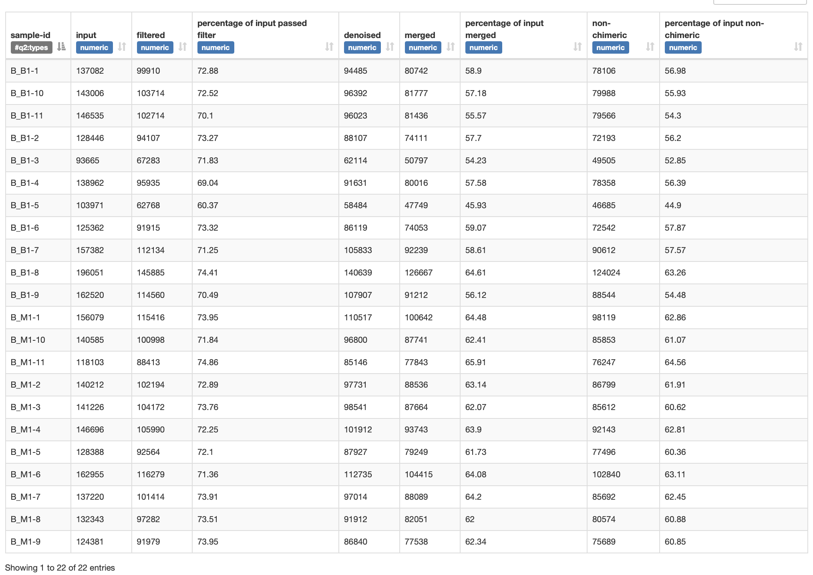

# Heterogeneity Spacer Trimming, Diagnostic Quality Profiling, and Amplicon Sequence Variant Inference via DADA2
**Date:** July 22, 2026  
**Project:** 04_MicroTom_P_Rhizosphere_Amplicon_Analysis  
**Target Assays:** Bacterial 16S rRNA (V3–V4) & Fungal ITS2  
**Input Artifacts:** `01_imported/demux_16S_*.qza`, `01_imported/demux_ITS_*.qza`  
**Output Artifacts:** `03_denoised_16S/table_16S_*.qza`, `03_denoised_16S/repseq_16S_*.qza`, `03_denoised_ITS/table_ITS_*.qza`, `03_denoised_ITS/repseq_ITS_*.qza`  

---

## 1. Methodological & Theoretical Rationale

### A. Primer and Spacer Demultiplexing via Cutadapt
Amplicon sequencing of the 16S V3–V4 and ITS2 regions utilizes degenerate primers containing IUPAC wobble bases (e.g., $N, W, H, V$) and staggered heterogeneity N-spacers (0–3 bp) preceding the locus-specific sequence. 

* **Artifact Elimination:** Heterogeneity spacers shift physical base positions across the flow cell to prevent phasing failures on the Illumina MiSeq. If not excised, these synthetic nucleotide insertions introduce false-positive biological variation, artificially inflating Amplicon Sequence Variant (ASV) richness.
* **Degeneracy Handling:** `--p-match-adapter-wildcards` and `--p-match-read-wildcards` ensure IUPAC degenerate positions (such as $N$ and $W$ in 341F, $H$ and $V$ in 805R) are interpreted as valid matches rather than sequencing errors.
* **Error Margin Selection:** An error tolerance rate of $0.15$ ($15\%$) allows up to 2 mismatches across the ~17–21 bp primer constructs, accommodating primer synthesis imperfections and terminal sequencing decay.
* **Biological Gatekeeping:** Setting `--p-discard-untrimmed` acts as a strict biological filter. Any read pair lacking the forward or reverse primer sequence is discarded, eliminating off-target genomic contamination, unindexed chimeric read-throughs, and low-molecular-weight primer-dimers.

---

## 2. Pre-Denoising Sequence Diagnostics (16S GB1 Benchmark)

Inspection of post-trimming visualization metrics (`trimmed_16S_GB1.qzv`) confirmed robust sequencing performance across all 22 biological replicates (11 Gijang B soil-treated, 11 MES buffer controls).

### Library Yield Metrics
* **Total Read Volume:** 3,061,170 paired reads across the batch.
* **Mean Depth:** 139,144 reads per library ($\sigma \approx 20,418$).
* **Extremes:** Ranged from 93,665 reads (`B_B1-3`) to 196,051 reads (`B_B1-8`), demonstrating sufficient coverage across all experimental units without severe library dropouts.

* **Length Verification:** Following primer excision, median read lengths stabilized at 284 bp for forward reads and 279–280 bp for reverse reads, confirming uniform cleavage of the 17 bp 341F and 21 bp 805R primer sequences along with their variable N-spacers.

---

## 3. Parametric Error Modeling & DADA2 Configuration

DADA2 treats amplicon sequence error resolution as a statistical deconvolution problem. Instead of clustering by an arbitrary sequence similarity threshold (e.g., 97% OTUs), DADA2 models the probability that an observed sequence $j$ with abundance $a_j$ was produced by sequence $i$ via amplification or sequencing error:

$$p(j \mid i) = \prod_{k=1}^{L} P(r_k \mid s_k, q_k)$$

Where $L$ is sequence length, $r_k$ is the observed nucleotide, $s_k$ is the true reference nucleotide, and $q_k$ is the Phred quality score.

### A. 16S V3–V4 Parameter Justification
Inspection of cycle-resolved Phred quality profiles demonstrates characteristic asymmetric degradation:
* **Forward Reads ($R_1$):** Maintain median $Q \ge 35$ across the first 200 cycles, with the lower quartile dipping toward $Q \approx 25$ past cycle 260.
* **Reverse Reads ($R_2$):** Exhibit severe quality drop-off due to accumulation of phasing noise, fluorophore degradation, and secondary structure generation, with median quality scores falling below $Q = 20$ after cycle 200.

**Parameter Selections:**
* `--p-trunc-len-f 260` and `--p-trunc-len-r 200`: Truncates low-quality terminal ends. While the raw PCR amplicon spans $\sim 440\text{--}460$ bp, primer excision in Step 1 reduces the template insert length to $\sim 400\text{--}425$ bp. The combined sequence length post-truncation is $260 + 200 = 460$ bp, guaranteeing an adequate physical overlap ($\sim 35\text{--}55$ bp, well above the $\ge 12\text{--}20$ bp minimum requirement) for deterministic contig assembly while eliminating terminal error propagation.
* `--p-max-ee-f 2.0` and `--p-max-ee-r 3.0`: Maximum Expected Errors ($\text{EE} = \sum 10^{-Q_k/10}$). The reverse threshold is relaxed to 3.0 to prevent disproportionate filtering of biologically authentic reverse reads affected by lower baseline Phred scores.

### B. Fungal ITS2 Parameter Strategy: Structural Zero Truncation
Unlike the fixed evolutionary distance of ribosomal 16S domains, fungal ITS regions exhibit broad phylogenetic length polymorphisms due to hypervariable insertions and deletions (ranging biologically from $< 200$ bp to $> 500$ bp).
* **Length Conservation:** Applying fixed positional truncation (`trunc-len`) to ITS amplicons artificially truncates biological features or eliminates amplicons shorter than the cutoff, introducing catastrophic phylogenetic taxa loss.
* **Configuration:** Truncation is disabled (`--p-trunc-len-f 0 --p-trunc-len-r 0`), delegating read retention entirely to the Expected Error filters (`max-ee-f 2.0`, `max-ee-r 3.0`).

---

## 4. Denoising and DADA2 Yield Diagnostics

Tracking read progression through filtering, error estimation, dereplication, paired-end merging, and bimera removal confirms the efficacy of the parameter design.

### Yield Trajectory (Batch `Bacteria_GB1`)

| Sample ID | Raw Input | Quality Filtered (% In) | Denoised Fwd | Denoised Rev | Merged Contigs (% In) | Non-Chimeric ASVs (% In) |
| :--- | :--- | :--- | :--- | :--- | :--- | :--- |
| **B_B1-1** | 137,082 | 99,910 (72.88%) | 94,485 | 94,485 | 80,742 (58.90%) | 78,106 (56.98%) |
| **B_B1-8** | 196,051 | 145,885 (74.41%) | 140,639 | 140,639 | 126,667 (64.61%) | 124,024 (63.26%) |
| **B_B1-3** | 93,665 | 67,283 (71.83%) | 62,114 | 62,114 | 50,797 (54.23%) | 49,505 (52.85%) |
| **B_B1-5** | 103,971 | 62,768 (60.37%) | 58,484 | 58,484 | 47,749 (45.93%) | 46,685 (44.90%) |
| **B_M1-1** | 156,079 | 115,416 (73.95%) | 110,517 | 110,517 | 100,642 (64.48%) | 98,119 (62.86%) |
| **B_M1-11** | 118,103 | 88,413 (74.86%) | 85,146 | 85,146 | 77,843 (65.91%) | 76,247 (64.56%) |

### Diagnostic Observations
1. **Filtering Retention:** Initial quality filtering retained $60.37\%\text{--}74.86\%$ of reads across samples (median $\sim 72.5\%$), indicating that the $Q$-score drop-off past cycle 200 in reverse reads did not cause unmanageable read attrition under the $\text{maxEE} = 3.0$ threshold.
2. **Merge Efficiency:** Paired-end contig assembly retained between $45.93\%$ and $65.91\%$ of original reads (typically $> 55\%$, with `B_B1-5` representing the lower boundary), proving that setting reverse truncation to cycle 200 retained sufficient physical sequence overlap with the 260 bp forward reads.
3. **Chimera Filtering:** De novo bimera removal identified and eliminated an average of only $1.5\%\text{--}2.5\%$ of merged reads, indicating low rates of PCR template switching during library amplification.
4. **Final Yield:** Final non-chimeric sequence recovery stabilized between $44.90\%$ and $64.56\%$ across all libraries (median $\sim 60\%$), delivering high-depth, high-confidence ASV count matrices suitable for statistical diversity calculations.

---

## 5. Multi-Batch Processing Registry

All 6 bacterial batches and 6 fungal batches completed primer trimming and DADA2 denoising using identical within-assay hyperparameter matrices:

| Target Assay | Batch | Trimming Input | Cutadapt Artifact | Truncation ($F/R$) | $\text{maxEE}$ ($F/R$) | DADA2 Feature Table | DADA2 Rep-Seqs |
| :--- | :--- | :--- | :--- | :--- | :--- | :--- | :--- |
| **16S** | `GB1` | `demux_16S_GB1.qza` | `trimmed_16S_GB1.qza` | 260 / 200 | 2.0 / 3.0 | `table_16S_GB1.qza` | `repseq_16S_GB1.qza` |
| **16S** | `GB2` | `demux_16S_GB2.qza` | `trimmed_16S_GB2.qza` | 260 / 200 | 2.0 / 3.0 | `table_16S_GB2.qza` | `repseq_16S_GB2.qza` |
| **16S** | `GB3` | `demux_16S_GB3.qza` | `trimmed_16S_GB3.qza` | 260 / 200 | 2.0 / 3.0 | `table_16S_GB3.qza` | `repseq_16S_GB3.qza` |
| **16S** | `GJ1` | `demux_16S_GJ1.qza` | `trimmed_16S_GJ1.qza` | 260 / 200 | 2.0 / 3.0 | `table_16S_GJ1.qza` | `repseq_16S_GJ1.qza` |
| **16S** | `GJ2` | `demux_16S_GJ2.qza` | `trimmed_16S_GJ2.qza` | 260 / 200 | 2.0 / 3.0 | `table_16S_GJ2.qza` | `repseq_16S_GJ2.qza` |
| **16S** | `GJ3` | `demux_16S_GJ3.qza` | `trimmed_16S_GJ3.qza` | 260 / 200 | 2.0 / 3.0 | `table_16S_GJ3.qza` | `repseq_16S_GJ3.qza` |
| **ITS2** | `GB1` | `demux_ITS_GB1.qza` | `trimmed_ITS_GB1.qza` | 0 / 0 | 2.0 / 3.0 | `table_ITS_GB1.qza` | `repseq_ITS_GB1.qza` |
| **ITS2** | `GB2` | `demux_ITS_GB2.qza` | `trimmed_ITS_GB2.qza` | 0 / 0 | 2.0 / 3.0 | `table_ITS_GB2.qza` | `repseq_ITS_GB2.qza` |
| **ITS2** | `GB3` | `demux_ITS_GB3.qza` | `trimmed_ITS_GB3.qza` | 0 / 0 | 2.0 / 3.0 | `table_ITS_GB3.qza` | `repseq_ITS_GB3.qza` |
| **ITS2** | `GJ1` | `demux_ITS_GJ1.qza` | `trimmed_ITS_GJ1.qza` | 0 / 0 | 2.0 / 3.0 | `table_ITS_GJ1.qza` | `repseq_ITS_GJ1.qza` |
| **ITS2** | `GJ2` | `demux_ITS_GJ2.qza` | `trimmed_ITS_GJ2.qza` | 0 / 0 | 2.0 / 3.0 | `table_ITS_GJ2.qza` | `repseq_ITS_GJ2.qza` |
| **ITS2** | `GJ3` | `demux_ITS_GJ3.qza` | `trimmed_ITS_GJ3.qza` | 0 / 0 | 2.0 / 3.0 | `table_ITS_GJ3.qza` | `repseq_ITS_GJ3.qza` |