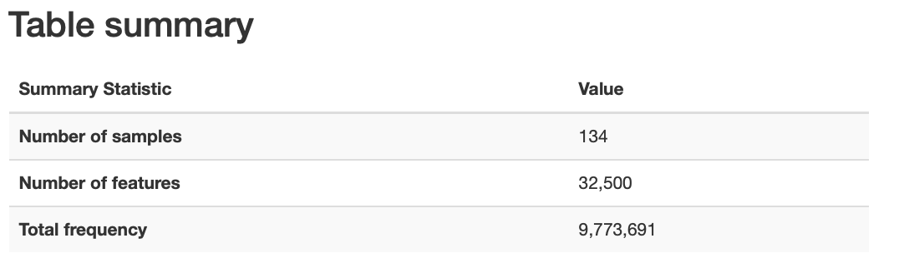
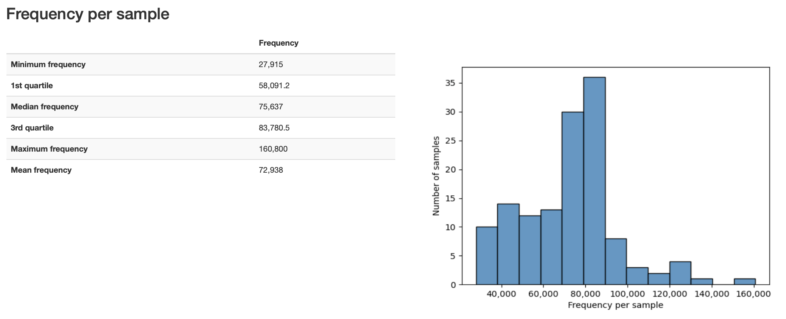
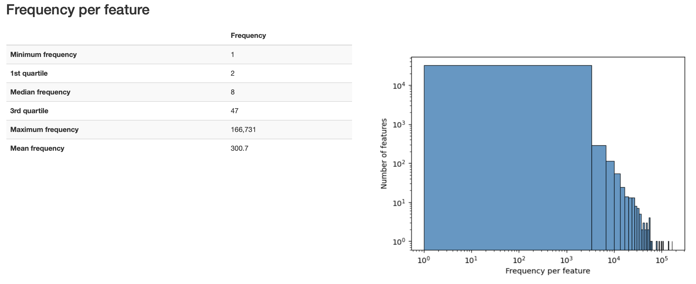

# Batch Consolidation, Phylogenetic Inference, Host Decontamination, and Cohort Stratification
**Date:** July 23, 2026  
**Project:** 04_MicroTom_P_Rhizosphere_Amplicon_Analysis
**Target Assays:** Bacterial 16S rRNA (V3–V4) & Fungal ITS2  
**Input Artifacts:** `03_denoised_16S/*`, `03_denoised_ITS/*`, `classifiers/*`  
**Output Artifacts:** `04_merged_16S/*`, `04_merged_ITS/*`, `06_phylo_16S/*`, `05_taxonomy_16S/*`, `05_taxonomy_ITS/*`, `metadata_P_generation.tsv`  

---

## 1. Methodological & Theoretical Rationale

### A. Batch Feature Table & Sequence Consolidation
Because DADA2 infers exact Amplicon Sequence Variants (ASVs) rather than clustering reads into arbitrary similarity bins (e.g., 97% OTUs), sequences across independent sequencing runs are directly comparable at single-nucleotide resolution.
* **Deterministic Matching:** Identical biological sequences generated across different physical MiSeq runs receive identical MD5 feature hashes. Merging collapses redundant features across batches while summing their counts across samples.
* **Cross-Batch Consistency:** Merging representative sequence sets confirms feature convergence without sequence inflation.

### B. Phylogenetic Reconstruction: Bacterial 16S vs. Fungal ITS
* **16S Multiple Sequence Alignment & FastTree:**
  1. *De Novo Alignment (`MAFFT`):* Aligns 32,500 bacterial ASVs based on conserved secondary structure motifs within the 16S rRNA gene.
  2. *Positional Masking:* Masks phylogenetically uninformative, hypervariable, or ambiguously aligned nucleotide columns to reduce tree reconstruction artifacts.
  3. *Approximately-Maximum-Likelihood Tree (`FastTree`):* Computes a generalized time-reversible (GTR) phylogenetic tree using heuristics to handle tens of thousands of taxa efficiently.
  4. *Midpoint Rooting:* Establishes a formal root at the midpoint of the longest path between any two tips, providing evolutionary branch-length context required for downstream phylogenetic beta-diversity metrics (Weighted and Unweighted UniFrac) and Faith’s Phylogenetic Diversity ($PD$).
* **Fungal ITS Tree Omission:**
  Global sequence alignment is **biologically invalid** for the fungal ITS2 locus. Unlike the catalytic 16S rRNA molecule, the non-coding internal transcribed spacer evolves through rapid insertions, deletions, and structural shifts. Because positional homology cannot be established across divergent fungal phyla (e.g., *Ascomycota* vs. *Basidiomycota* vs. *Mucoromycota*), phylogenetic tree reconstruction is bypassed. Downstream fungal community analyses rely exclusively on non-phylogenetic distance metrics (Bray-Curtis and Jaccard).

### C. Taxonomic Classification & Decontamination Logic
Sequences were classified using optimized Naive Bayes classifiers trained on the **SILVA 138** (99% OTUs, full-length 16S) and **UNITE v10** (dynamic species hypotheses, ver10 release) databases.

* **16S Negative Exclusion Filtering:**
  Universal 16S primers (341F/805R) cross-amplify non-target DNA:
  * `chloroplast` & `mitochondria`: Co-amplified organellar DNA from tomato root tissue (*Solanum lycopersicum* plastid 16S and mitochondrial 18S-like segments).
  * `Archaea` & `Eukaryota`: Off-target domains outside the scope of the bacterial survey.
  * `Cyanobacteria`: Often originates from plant chloroplast homology or photosynthetic surface contaminants in soil/peat plugs.
  * `Rickettsiales` & `Rickettsiellales`: Obligate intracellular alphaproteobacteria with close ancestral homology to plant mitochondria.
  * `Unassigned`: Sequences lacking recognizable bacterial phylum-level markers, typically representing non-specific amplification artifacts or chimeric read-throughs.
* **Fungal ITS Positive Inclusion Filtering:**
  Primer sets ITS3/ITS4 cross-amplify host plant nuclear ribosomal DNA and soil microeukaryotes. An inclusion filter retaining strictly `k__Fungi` removes host plant amplifications, protists, and unassigned eukaryotic noise.

### D. Anomaly Handling & Experimental Cohort Stratification
During the harvest of cohort `GJ3`, specific samples were labeled with terminal suffixes `x` or `y` (e.g., `B_J2x`, `B_J2y`, `B_J13x`). 
* **Biological Ambiguity:** Physical records indicated a suspected mislabeling where control samples were designated with `x` and treated samples with `y`. However, because assignment certainty cannot be confirmed *a priori*, retaining these samples inside primary experimental contrasts introduces potential classification error.
* **Bifurcated Workflow Architecture:**
  1. **Clean / Full Cohorts (`table_*_clean.qza`):** Retain all 134 decontaminated samples, including `Extra_Sample` profiles. Used for quality benchmarking, ordination topology tests, and checking whether `x`/`y` samples cluster consistently with known treatment centroids.
  2. **Standard Cohorts (`table_*_standard.qza`):** Filtered against `metadata_P_generation.tsv` using `[Sample_Type] = 'Standard'`. Excludes all ambiguous `Extra_Sample` replicates, establishing a clean experimental baseline for primary hypothesis testing (GB vs. GB Control, GJ vs. GJ Control).

```
                      Raw Denoised ASV Batches (12 Runs)
                                      │
                        qiime feature-table merge
                                      │
                         Merged ASV Tables & Seqs
                                      │
              ┌───────────────────────┴───────────────────────┐
              ▼                                               ▼
     Bacterial 16S Branch                            Fungal ITS Branch
              │                                               │
   MAFFT + FastTree Rooting                         [No Tree Construction]
              │                                               │
   SILVA 138 Classification                        UNITE v10 Classification
              │                                               │
   Exclusion Filtering                             Inclusion Filtering
   (Host, Organelle, Cyanobacteria)                (Strictly k__Fungi)
              │                                               │
              └───────────────────────┬───────────────────────┘
                                      ▼
                        Metadata-Driven Stratification
                       (metadata_P_generation.tsv)
                                      │
         ┌────────────────────────────┴────────────────────────────┐
         ▼                                                         ▼
  Clean / Full Tables                                      Standard Tables
  (N = 134; Includes Extra x/y)                           (N = 120; Standard Only)
  - Sensitivity checks                                     - Primary Hypothesis Testing
  - Ordination consistency                                 - Growth Trait Correlation
```

---

## 2. Global Feature Synthesis Diagnostics (16S Merged Baseline)

Initial consolidation across the 6 bacterial batches generated the master frequency table `table_16S_merged.qzv`, establishing sequencing coverage across the P generation rhizosphere cohort.



### Summary Statistics
* **Sample Count:** 134 total sequencing libraries.
* **ASV Richness:** 32,500 distinct bacterial amplicon sequence variants.
* **Total Read Volume:** 9,773,691 high-confidence non-chimeric reads.

---

### Library Depth Distribution



* **Coverage Uniformity:** Library sizes exhibit a unimodal distribution centered tightly around the mean ($72,938$ reads) and median ($75,637$ reads).
* **Interquartile Range:** Spans from $58,091.2$ reads (25th percentile) to $83,780.5$ reads (75th percentile).
* **Minimum Retained Depth:** The lowest library achieved $27,915$ reads, establishing that subsequent rarefaction thresholds can target $> 25,000$ reads per sample without dropping experimental replicates.
* **Maximum Retained Depth:** $160,800$ reads.

---

### Feature Distribution & Sparsity



* **Long-Tail Sparsity:** In line with soil microbiome distributions, feature frequencies follow a power-law curve.
* **Low-Frequency Dominance:** 
  * 1st Quartile frequency = 2 counts.
  * Median frequency = 8 counts across all 134 samples.
  * 3rd Quartile frequency = 47 counts.
* **Dominant Core Taxa:** Mean feature frequency reaches $300.7$ counts, driven by an elite fraction of rhizosphere-adapted ASVs reaching up to $166,731$ counts. This distribution emphasizes the need for compositional zero handling and variance-stabilizing normalization downstream.

---

## 3. Metadata Configuration Matrix (`metadata_P_generation.tsv`)

Metadata parsing structured all 134 samples into a validated QIIME 2 mapping scheme, isolating ambiguous labels while preserving operational factors.

### Field Definitions & Typing

| Header Field | QIIME 2 Type | Theoretical Purpose | Levels / Structure |
| :--- | :--- | :--- | :--- |
| `sample-id` | `#q2:types` | Unique run identifier | `B_*`, `F_*` |
| `Domain` | `categorical` | Amplicon target organism | `Bacteria`, `Fungi` |
| `Sample_Type` | `categorical` | Verification status | `Standard`, `Extra_Sample` |
| `Treatment_Group` | `categorical` | Experimental condition | `GB_Treatment`, `GB_Control`, `GJ_Treatment`, `GJ_Control`, `*_Extra` |
| `Target_Soil` | `categorical` | Inoculum geographic origin | `Gijang_B`, `Gyeongju`, `Base_Soil` |
| `Inoculum` | `categorical` | Physical biological source | `GB_Soil_Suspension`, `GJ_Soil_Suspension`, `MES_Buffer_Alone` |
| `Sequencing_Batch`| `categorical` | Batch effect blocking factor | `GB1`, `GB2`, `GB3`, `GJ1`, `GJ2`, `GJ3`, `GJ3_Extra` |
| `Generation` | `categorical` | Plant lineage stage | `P` |

---

## 4. Cohort Partitioning Summary

Applying taxonomic filters and metadata criteria partitioned the dataset into primary and sensitivity tables:

### Processed Artifacts

| Target Assay | Processing State | Artifact File | Filtering Criteria | Primary Downstream Application |
| :--- | :--- | :--- | :--- | :--- |
| **16S** | Merged Raw | `04_merged_16S/table_16S_merged.qza` | None | Initial QC inspection |
| **16S** | Decontaminated Full | `05_taxonomy_16S/table_16S_clean.qza` | Host / Organelle Excluded | Ordination sensitivity testing ($N=134$) |
| **16S** | Standard Curated | `05_taxonomy_16S/table_16S_standard.qza` | Cleaned + `Sample_Type == Standard` | Primary hypothesis testing & phenotype correlation ($N=120$) |
| **ITS2** | Merged Raw | `04_merged_ITS/table_ITS_merged.qza` | None | Initial QC inspection |
| **ITS2** | Decontaminated Full | `05_taxonomy_ITS/table_ITS_clean.qza` | Positive `k__Fungi` Retained | Fungal ordination sensitivity testing ($N=134$) |
| **ITS2** | Standard Curated | `05_taxonomy_ITS/table_ITS_standard.qza` | Cleaned + `Sample_Type == Standard` | Primary fungal community modeling ($N=120$) |