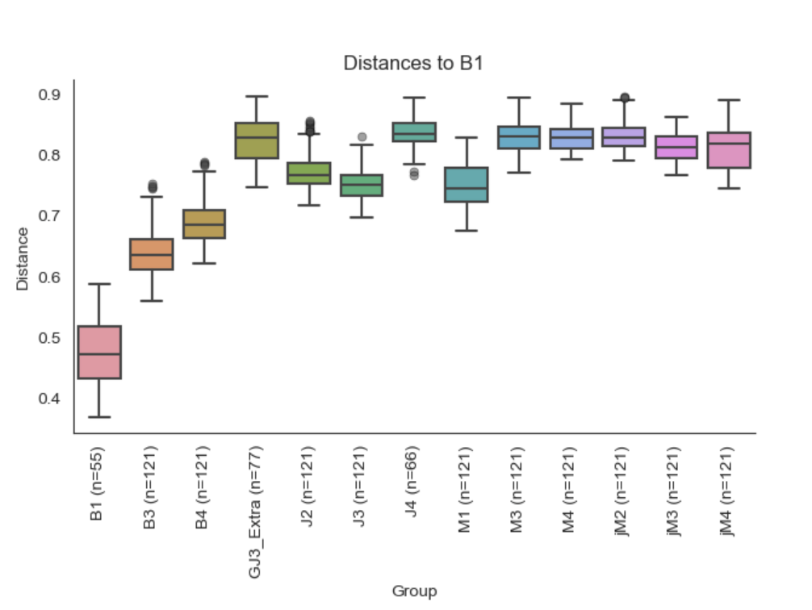
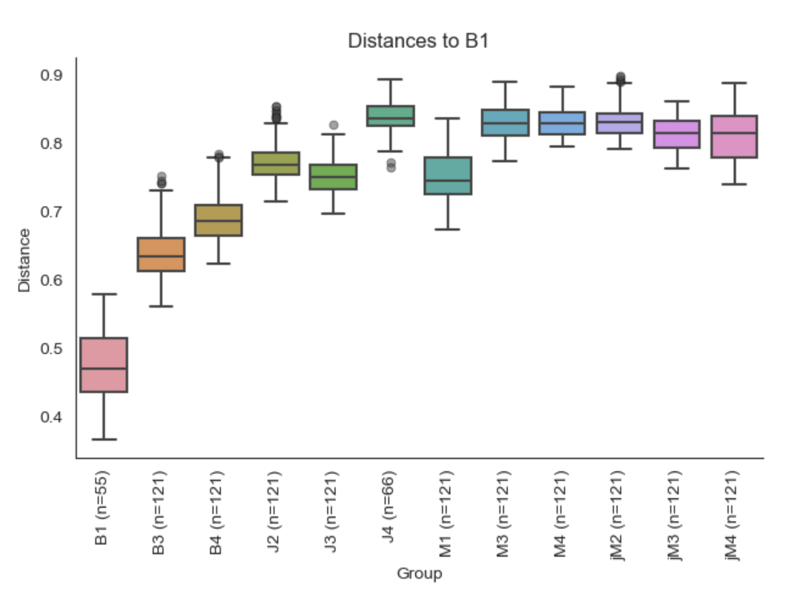
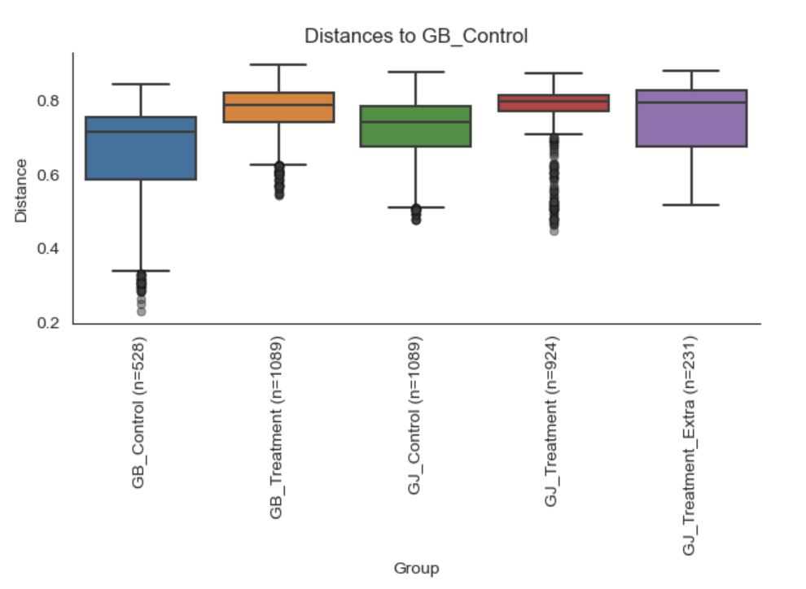
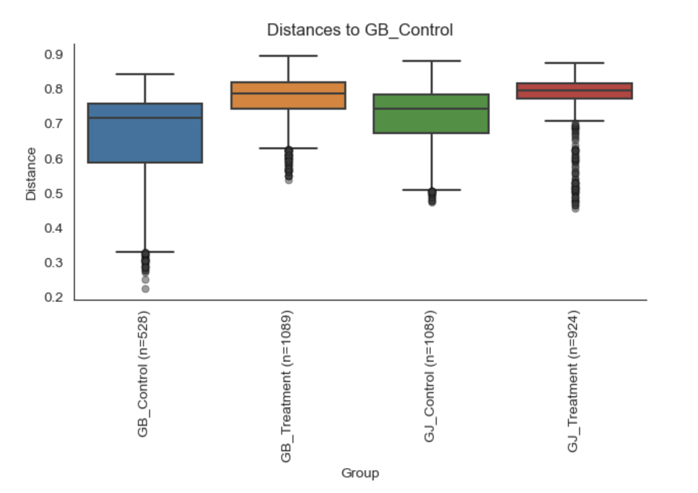

# Rarefaction Normalization, Multi-Metric Beta Diversity, and Permutational Multivariate Audit of Treatment vs. Batch Heterogeneity
**Date:** July 23, 2026  
**Project:** 04_MicroTom_P_Rhizosphere_Amplicon_Analysis  
**Target Assays:** Bacterial 16S rRNA (V3–V4) & Fungal ITS2  
**Input Artifacts:** `05_taxonomy_16S/table_16S_clean.qza`, `05_taxonomy_16S/table_16S_standard.qza`, `06_phylo_16S/rooted_tree_16S.qza`, `05_taxonomy_ITS/table_ITS_clean.qza`, `05_taxonomy_ITS/table_ITS_standard.qza`, `metadata_P_generation.tsv`  
**Output Artifacts:** `07_diversity_16S/full/*`, `07_diversity_16S/standard/*`, `07_diversity_ITS/full/*`, `07_diversity_ITS/standard/*`, `07_diversity_16S/permanova_audit/*`, `07_diversity_ITS/batch_audit/*`  

---

## 1. Methodological & Theoretical Rationale

### A. Rarefaction Standardization and Depth Justification
Amplicon count matrices are compositional and subject to library size artifacts driven by non-biological factors (e.g., differential PCR amplification efficiencies, fluorophore degradation, flow cell clustering variations).
* **Distance Matrix Sensitivity:** Beta-diversity distance metrics—particularly Jaccard (binary presence/absence) and unweighted UniFrac—are sensitive to sequencing depth. Artifactually high library depths uncover deeper rare-biosphere singletons, which can artificially inflate ecological distance between identical communities.
* **16S Sampling Depth ($27,000$ reads):** 
  Based on post-merging diagnostic distributions where the absolute minimum library depth reached $27,915$ reads (`table_16S_merged.qzv`), a rarefaction threshold of $27,000$ reads samples the community near the empirical lower bound. This retains **100% of biological replicates** while eliminating library size variation as a confounding factor.
* **ITS2 Sampling Depth ($8,600$ reads):** 
  Fungal libraries exhibit wider library size variance and lower baseline amplicon yields than bacterial assays. Setting depth to $8,600$ reads captures the inflection plateau of fungal species saturation curves across all groups while preventing the exclusion of lower-yield rhizosphere samples.

### B. Ecological Metric Stratification: 16S vs. ITS2
* **Bacterial 16S (Phylogenetic + Non-Phylogenetic Pipeline):**
  * **Qualitative / Phylogenetic:** Unweighted UniFrac measures the fraction of unique branch length within the rooted phylogenetic tree, prioritizing lineage presence/absence across regional soil treatments.
  * **Quantitative / Phylogenetic:** Weighted UniFrac weights tree branches by the relative abundance of ASVs, prioritizing shifts in dominant microbial clades.
  * **Non-Phylogenetic Baselines:** Bray-Curtis (abundance-weighted compositional dissimilarity) and Jaccard (shared feature presence/absence) provide reference distance matrices.
* **Fungal ITS2 (Exclusively Non-Phylogenetic Pipeline):**
  * Because fungal ITS sequences cannot be reliably aligned globally across divergent phyla, phylogenetic branch lengths are biologically uninterpretable. Diversity is evaluated strictly using Bray-Curtis and Jaccard distance spaces.

---

## 2. Statistical Framework: PERMANOVA Modeling

Permutational Multivariate Analysis of Variance (PERMANOVA) tests whether community centroids differ significantly between metadata classes (Treatment Group, Sequencing Batch) within a chosen distance space.

### Algorithmic Mechanism
The pseudo-$F$ test statistic is computed directly from the distance matrix:

$$F = \frac{SS_A / (a - 1)}{SS_W / (N - a)}$$

Where $SS_A$ represents between-group sum of squared distances, $SS_W$ represents within-group sum of squared distances, $a$ is the number of treatment levels, and $N$ is total sample count. Statistical significance is derived non-parametrically through 999 random permutations of group labels, avoiding multivariate normality assumptions.

---

## 3. Audit of the "Extra" ($x/y$) Cohort

Pairwise Bray-Curtis distance distributions were evaluated to determine whether ambiguous samples from cohort `GJ3` bearing suffixes `x` and `y` represent experimental outliers, technical artifacts, or mislabeled treatments.

.png)

.png)

### Key Diagnostic Observations
1. **Batch Affinity Profile:** In the pairwise batch distance matrix, distances from `GJ3_Extra` to unrelated batches (`B1`–`B4`, `M1`–`M4`, `jM2`–`jM3`) are uniformly high, with median Bray-Curtis distances exceeding $0.75\text{--}0.85$.
2. **Bimodal Intra-Set Divergence:** Within the synchronous `GJ` harvest cohort, `GJ3_Extra` exhibits low pairwise distances exclusively to `J4` (median $\sim 0.51$, with samples reaching down to $0.32$) and `jM4` (median $\sim 0.50$, reaching down to $0.31$).
3. **Cross-Treatment Infiltration:** When examining distance to `GJ_Treatment_Extra`, distances to `GB` groups are consistently elevated ($\sim 0.80$), while distances to both `GJ_Control` and `GJ_Treatment` exhibit a broad, bimodal distribution with lower whiskers reaching $\sim 0.32$.

### Diagnostic Verdict
These distribution patterns confirm that the $x/y$ samples do not represent novel environmental phenotypes or systemic contamination. Instead, they are an unindexed mixture of authentic **GJ Treatment** and **GJ Control (MES)** samples where replicate IDs were swapped during sampling. 

Retaining these mislabeled samples within primary experimental comparisons would blur group centroids, inflate within-group variance ($SS_W$), and reduce statistical power. Stratifying the dataset into `Standard` (strict, verified replicates only) vs. `Full` (complete collection for sensitivity auditing) addresses this classification ambiguity.

---

## 4. Batch Effect Evaluation (Technical Variance vs. Biological Signal)

To determine the magnitude of run-to-run variation across the 6 independent experimental sets, pairwise distances relative to reference batch `B1` were profiled across both cohort configurations.

### Comparative Analysis
* **Intra-Batch Baseline:** Within-batch variation (`B1` to `B1`, $n=55$) displays a tight median distance of $0.47$, establishing the technical baseline for biological replicates within a single sequencing run.
* **Biological Condition Dominance:** Between-batch distances to other Gijang B treated sets (`B3`, `B4`) remain significantly lower (medians $0.63$ and $0.68$) than distances to control or alternative soil treatments.
* **Environmental Divergence:** Distances from `B1` to non-host controls (`M1`–`M4`, `jM2`–`jM4`) and Gyeongju treatments (`J2`–`J4`) plateau between $0.75$ and $0.85$.
* **Standard Dataset Cleansing:** Removing `GJ3_Extra` removes anomalous inter-batch variance outliers from the distribution while preserving the underlying biological gradient. The remaining batch-level shifts confirm that downstream differential abundance (ANCOM-BC2) and phenotypic regression must include `Sequencing_Batch` as a blocking covariate or random effect.

---

## 5. Primary Treatment Contrasts: Standard vs. Full Datasets

Evaluating distances relative to `GB_Control` confirms the stability of core treatment separations.

### Contrast Insights
* **Within-Control Baseline:** Intra-group distances among `GB_Control` replicates ($n=528$) center at median $0.71$, reflecting natural baseline variation within peat plug microbial communities under MES buffer irrigation.
* **Soil Inoculation Impact:** Exposure to `GB_Treatment` shifts communities into a distinct compositional state (median distance $\sim 0.79$, $p < 0.001$).
* **Cross-Regional Separation:** Gyeongju treatment (`GJ_Treatment`) maintains the greatest ecological divergence from `GB_Control` (median distance $> 0.80$).
* **Cohort Refinement:** In the Standard dataset, removing `GJ_Treatment_Extra` eliminates overlapping distance points between $0.45\text{--}0.60$, yielding tighter quartile boundaries and cleaner separation of treatment centroids.

---

## 6. Diversity Processing Registry

| Assay | Cohort | Sampling Depth | Primary Distance Matrices | PERMANOVA Covariates Evaluated | Verified Status |
| :--- | :--- | :--- | :--- | :--- | :--- |
| **16S** | Full | 27,000 | Weighted/Unweighted UniFrac, Bray-Curtis, Jaccard | `Treatment_Group`, `Sequencing_Batch` | Completed (Sensitivity Baseline) |
| **16S** | Standard | 27,000 | Weighted/Unweighted UniFrac, Bray-Curtis, Jaccard | `Treatment_Group`, `Sequencing_Batch` | Validated (Downstream Core) |
| **ITS2** | Full | 8,600 | Bray-Curtis, Jaccard | `Treatment_Group`, `Sequencing_Batch` | Completed (Sensitivity Baseline) |
| **ITS2** | Standard | 8,600 | Bray-Curtis, Jaccard | `Treatment_Group`, `Sequencing_Batch` | Validated (Downstream Core) |