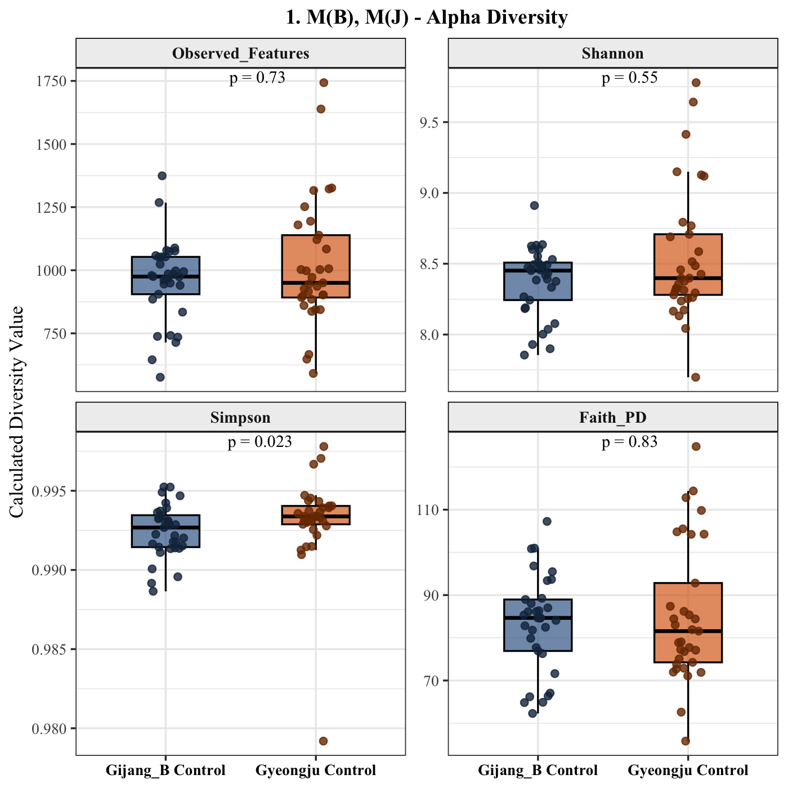
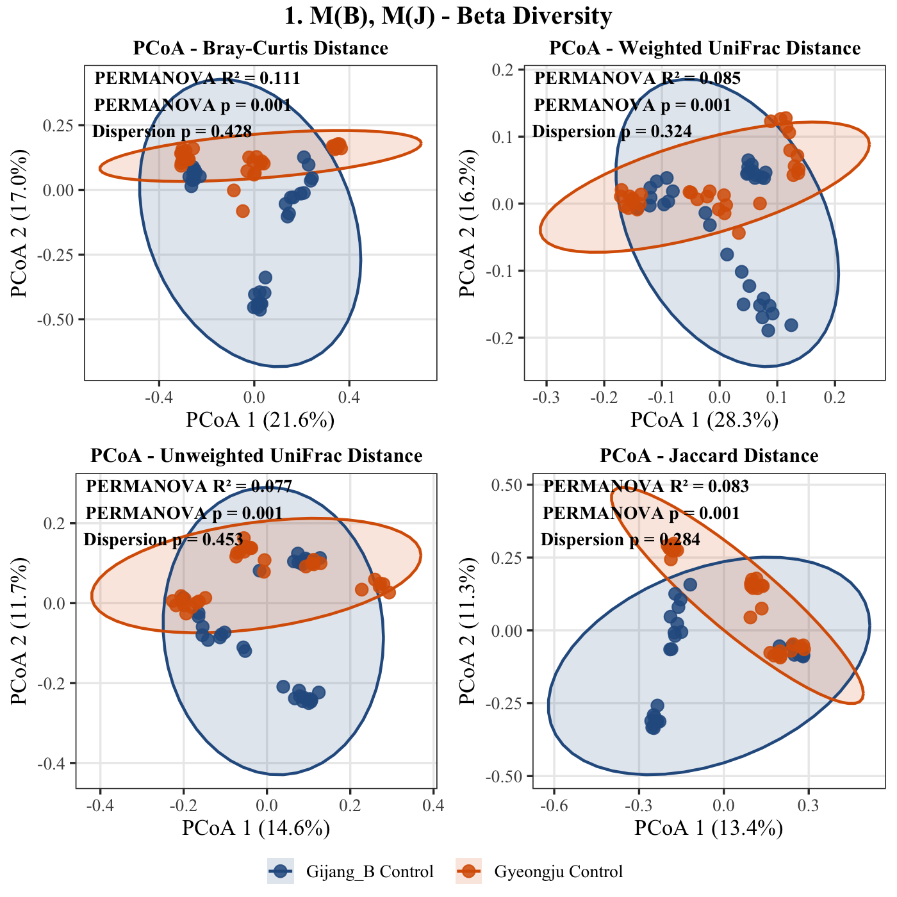
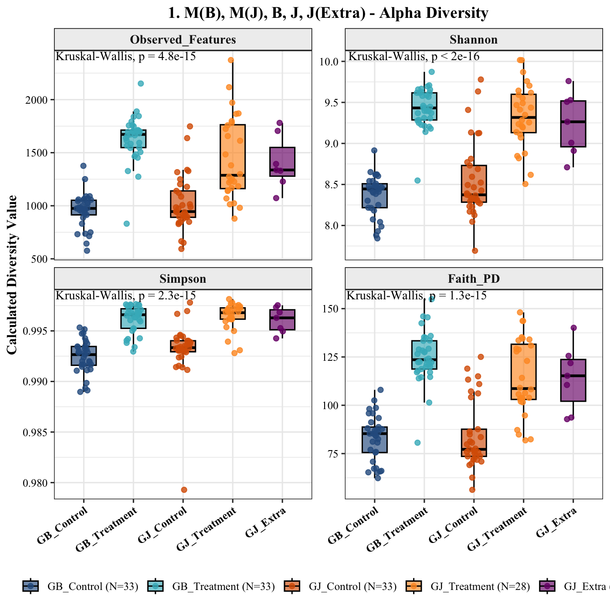
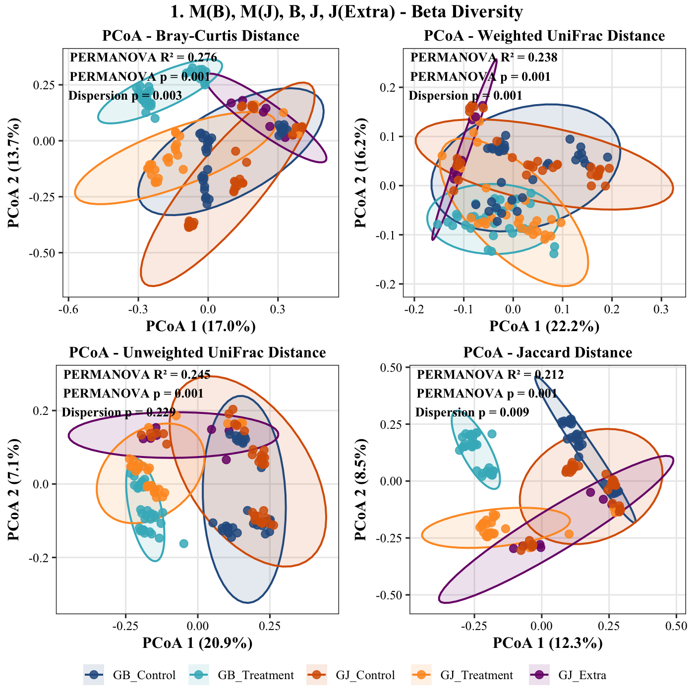
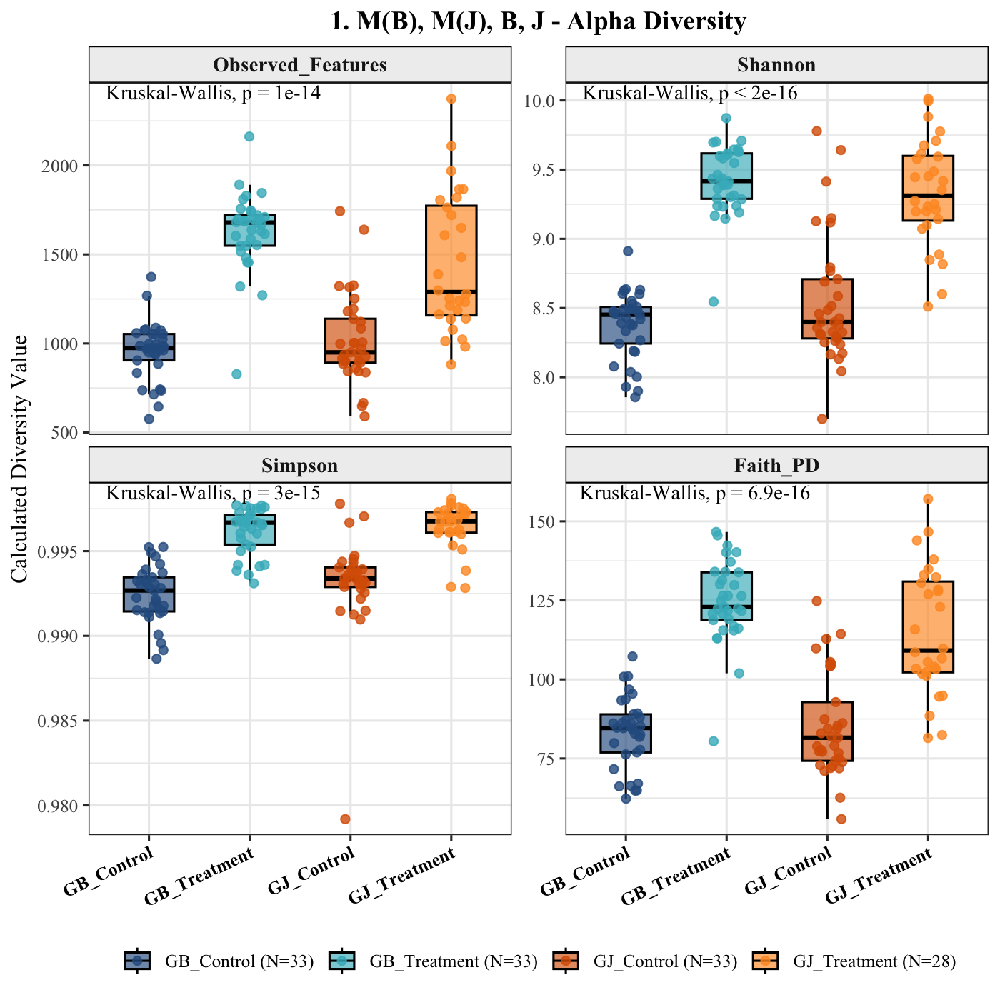
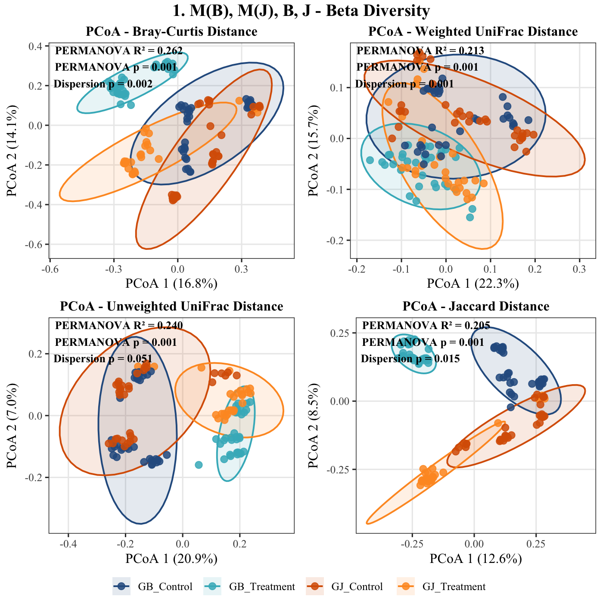
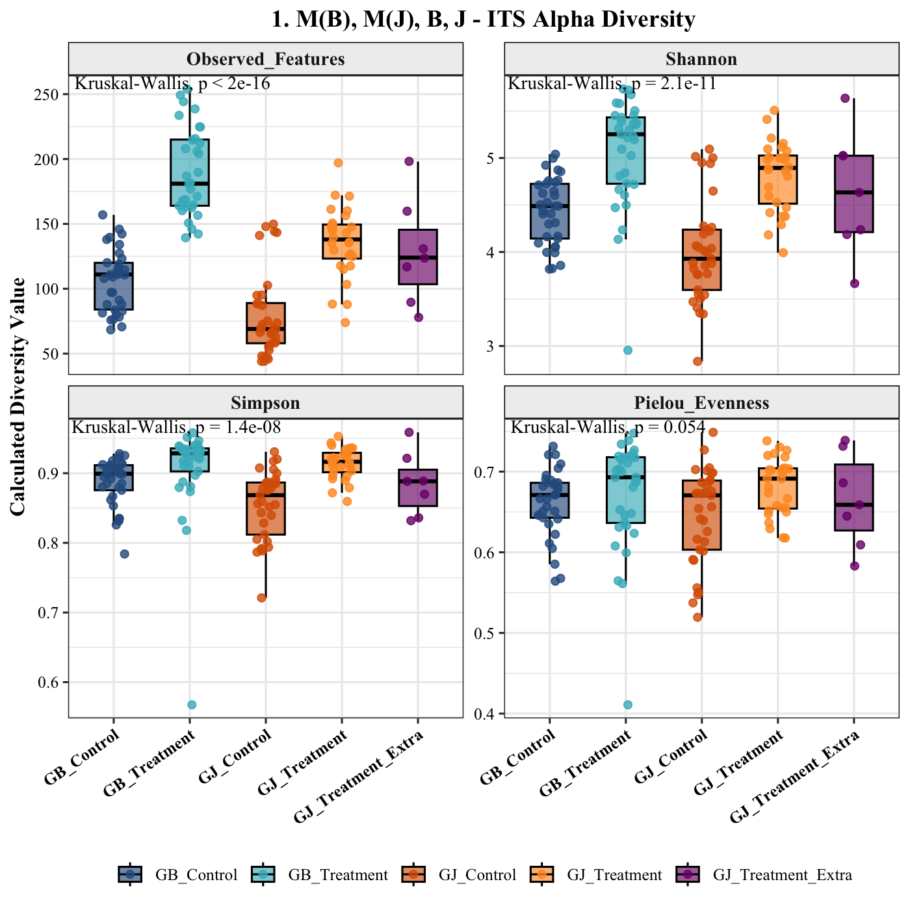
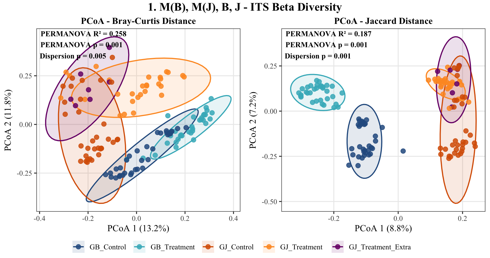

# Microbial Diversity Profiling and Control Cohort Validation in R
**Date:** July 24, 2026  
**Project:** 04_MicroTom_P_Rhizosphere_Amplicon_Analysis  
**Target Assays:** Bacterial 16S rRNA (V3–V4) & Fungal ITS2  
**Platform:** R v4.6.1 (`aarch64-apple-darwin23`, Native ARM64)  
**Input Artifacts:** `07_diversity_16S/*`, `07_diversity_ITS/*`, `05_taxonomy_16S/*`, `05_taxonomy_ITS/*`, `metadata_P_generation.tsv`  

---

## 1. Ecological Metrics & Mathematical Formulations

To evaluate intra-sample community complexity and inter-sample ecological divergence, count data were parsed into `phyloseq` containers using `qiime2R` and evaluated across complementary diversity metrics.

### A. Alpha Diversity (Within-Sample Heterogeneity)
* **Observed Features ($S$):** Direct count of unique Amplicon Sequence Variants (ASVs) detected per sample, measuring total richness.
* **Shannon Diversity Index ($H'$):** Combines richness and abundance evenness, weighting rare taxa:
  $$H' = -\sum_{i=1}^{S} p_i \ln p_i$$
  where $p_i$ is the proportional abundance of feature $i$.
* **Simpson Diversity Index ($D$):** Emphasizes dominance and common taxa:
  $$D = 1 - \sum_{i=1}^{S} p_i^2$$
* **Faith’s Phylogenetic Diversity ($\text{PD}$):** Sum of branch lengths on the rooted phylogenetic tree connecting all members of the observed community:
  $$\text{PD} = \sum_{b \in T(S)} l_b$$
  where $T(S)$ is the minimum spanning subtree for observed taxa set $S$, and $l_b$ is the length of branch $b$. Evaluates evolutionary lineage breadth (calculated exclusively for 16S bacterial data).
* **Pielou’s Evenness ($J'$):** Normalizes Shannon entropy against total observed richness:
  $$J' = \frac{H'}{\ln S}$$

### B. Beta Diversity & Ordination (Between-Sample Dissimilarity)
* **Bray-Curtis Dissimilarity:** Abundance-weighted compositional distance:
  $$BC_{jk} = \frac{\sum_{i} \vert{}x_{ij} - x_{ik}\vert{}}{\sum_{i} (x_{ij} + x_{ik})}$$
  where $C_{jk}$ is the sum of minimum counts for features shared between samples $j$ and $k$, and $S_j, S_k$ are the total counts.
* **Jaccard Distance:** Unweighted, presence-absence metric assessing taxonomic turnover:
  $$J = 1 - \frac{|A \cap B|}{|A \cup B|}$$
* **Unweighted UniFrac:** Qualitative phylogenetic metric measuring the fraction of unshared branch length between two communities.
$$u = \frac{\sum_{i=1}^{n} l_i \cdot \mathbb{I}(i)}{L_T}$$
* **Weighted UniFrac:** Quantitative phylogenetic metric weighting branch length differences by relative abundance differences, prioritizing shifts in dominant lineages.
$$d = \frac{\sum_{i=1}^{n} l_i \cdot \vert{}p_{i,A} - p_{i,B}\vert{}}{\sum_{i=1}^{n} l_i \cdot (p_{i,A} + p_{i,B})}$$
* **Principal Coordinate Analysis (PCoA):** Eigenvalue decomposition of distance matrices, projecting maximal multidimensional variance across orthogonal axes.

---

## 2. Experimental Control Audit: GB_Control vs. GJ_Control

Because Gijang B and Gyeongju cultivation cycles operated on asynchronous experimental timelines, separate control batches were maintained (`GB_Control` = Peat plug + MES buffer; `GJ_Control` = Peat plug + MES buffer). A critical question was whether these control groups could be statistically pooled into a single reference baseline.

### Alpha Diversity Observations
* **Richness & Lineage Breadth:** No significant differences are detected between `GB_Control` and `GJ_Control` for Observed Features ($p = 0.73$), Shannon entropy ($p = 0.55$), or Faith’s PD ($p = 0.83$).
* **Evenness Divergence:** Simpson dominance displays marginal divergence ($p = 0.023$), with `GJ_Control` displaying slightly higher dominance concentration.

### Beta Diversity Ordination & PERMANOVA
* **Centroid Separation:** Multivariate tests confirm statistically significant community divergence between the two control groups across all distance spaces:
  * Bray-Curtis: $R^2 = 0.111$, $p = 0.001$
  * Weighted UniFrac: $R^2 = 0.085$, $p = 0.001$
  * Unweighted UniFrac: $R^2 = 0.077$, $p = 0.001$
  * Jaccard: $R^2 = 0.083$, $p = 0.001$
* **Dispersion Homogeneity:** Betadisper tests show no significant variance heterogeneity across groups (all dispersion $p > 0.28$). This confirms that the observed PERMANOVA separation reflects genuine ecological centroid displacement rather than group variance artifacts.

**Analytical Verdict:** While basal peat plug alpha diversity remains stable across timeline replicates, beta-diversity shifts demonstrate significant baseline turnover. Pooling controls is invalid; all treatment evaluations must be benchmarked strictly against their synchronous temporal controls (`GB_Treatment` vs. `GB_Control`; `GJ_Treatment` vs. `GJ_Control`).

---

## 3. Bacterial 16S Diversity Dynamics

### A. Full Cohort (With $x/y$ Extra Samples)

* **Alpha Diversity:** Soil inoculation substantially expands bacterial community richness (Kruskal-Wallis $p < 10^{-14}$ across all four metrics). Control libraries average $\sim 1000$ ASVs, whereas `GB_Treatment` and `GJ_Treatment` average $1500\text{--}1700$ ASVs.
* **Ordination Artifacts:** `GJ_Extra` exhibits broad, diffuse dispersion across PCoA space. In unweighted UniFrac and Jaccard ordinations, `GJ_Extra` samples bridge the space between `GJ_Control` and `GJ_Treatment`, consistent with the label-swap hypothesis identified during feature table auditing.

---

### B. Standard Cohort (Without $x/y$ Extra Samples)

* **Community Richness Shifts:** Removal of ambiguous samples sharpens treatment separation across Observed Features ($p = 10^{-14}$), Shannon ($p < 2 \times 10^{-16}$), Simpson ($p = 3 \times 10^{-15}$), and Faith’s PD ($p = 6.9 \times 10^{-16}$). Inoculation introduces a broad spectrum of evolutionary clades from field soil into the host rhizosphere.
* **Beta Diversity Ordination Structure:**
  * **PCoA Axis 1 ($16.8\%\text{--}22.3\%$ of variance):** Captures the primary biological contrast between uninoculated peat controls and soil-treated rhizospheres.
  * **PCoA Axis 2 ($7.0\%\text{--}15.7\%$ of variance):** Resolves regional soil chemistry and biological origin, cleanly separating the Gijang B lineage from the Gyeongju lineage.
  * **Lineage-Specific Affinity:** `GJ_Control` samples orient closer to `GJ_Treatment` than to `GB_Treatment`, while `GB_Control` samples orient toward `GB_Treatment`. PERMANOVA confirms strong group-level structure across Bray-Curtis ($R^2 = 0.262, p = 0.001$), Weighted UniFrac ($R^2 = 0.213, p = 0.001$), and Jaccard ($R^2 = 0.205, p = 0.001$).

---

## 4. Fungal ITS Diversity Dynamics

### A. Alpha Diversity Profiles
* **Richness Divergence:** Fungal community richness differs sharply across experimental groups (Observed Features $p < 2 \times 10^{-16}$; Shannon $p = 2.1 \times 10^{-11}$; Simpson $p = 1.4 \times 10^{-8}$).
* **Treatment Contrasts:** Control rhizospheres display low fungal richness (median $\sim 110$ ASVs for `GB_Control`, $\sim 70$ ASVs for `GJ_Control`). Inoculation induces significant colonization, with `GB_Treatment` reaching a median of $\sim 180$ ASVs and `GJ_Treatment` averaging $\sim 140$ ASVs.
* **Evenness Stability:** Pielou’s evenness shows no pronounced group-level differences ($p = 0.054$), indicating that fungal community expansion is driven primarily by taxonomic acquisition rather than structural changes in dominant taxa.

### B. Beta Diversity Profiles
* **Regional Separation:** PCoA ordination reveals strong clustering along Axis 1 ($13.2\%$ in Bray-Curtis; $8.8\%$ in Jaccard), driven by the geographic source of the soil inoculum.
* **Community Turnover:** The Gijang B fungal assemblage occupies a distinct coordinate space from the Gyeongju lineage. In both Bray-Curtis ($R^2 = 0.258, p = 0.001$) and Jaccard ($R^2 = 0.187, p = 0.001$), the controls cluster adjacent to their respective treatments along Axis 2, demonstrating that fungal rhizosphere colonization reflects the regional fungal species pool of each input soil.al Framework

QIIME 2 diversity outputs were ingested into R using `qiime2R` and structured into unified `phyloseq` containers to evaluate community restructuring induced by regional soil suspensions (Gijang B vs. Gyeongju).

* **Alpha Diversity Modeling:** Evaluated via **Observed ASV Richness** (count of non-zero features), **Shannon Diversity** ($H' = -\sum p_i \ln p_i$), **Simpson Dominance Index** ($1 - D = 1 - \sum p_i^2$), and **Faith’s Phylogenetic Diversity** ($PD$, sum of branch lengths on the rooted insertion tree). Group distributions were evaluated using non-parametric Kruskal-Wallis tests followed by pairwise Wilcoxon rank-sum tests.
* **Beta Diversity & Ordination:** Principal Coordinates Analysis (PCoA) was performed across qualitative (Jaccard, Unweighted UniFrac) and quantitative (Bray-Curtis, Weighted UniFrac) distance spaces.
* **Multivariate Significance & Homogeneity of Dispersion:** Differences in community centroids were tested via PERMANOVA (`adonis2`, 999 permutations). Multivariate dispersion homogeneity was audited via `betadisper` to verify that significant PERMANOVA results reflect true centroid shifts rather than variance inequalities across groups.

---

## 2. Baseline Control Lineage Audit: GB_Control vs. GJ_Control

Due to asynchronous growth schedules during the Parent generation experiment, the Gijang B set (`GB_Control` / `GB_Treatment`) and Gyeongju set (`GJ_Control` / `GJ_Treatment`) were cultivated in separate temporal batches. To test whether the two baseline controls (peat plug + MES buffer) could be pooled into a shared reference group, their diversity profiles were evaluated directly.

### A. Alpha Diversity Divergence
* **Richness & Phylogeny Invariance:** Baseline ASV richness (**Observed Features**, $p = 0.73$), phylogenetic breadth (**Faith_PD**, $p = 0.83$), and general entropy (**Shannon**, $p = 0.55$) show no statistically significant divergence between `Gijang_B Control` and `Gyeongju Control`.
* **Evenness Divergence:** The **Simpson index** displays a statistically significant shift ($p = 0.023$), with `Gyeongju Control` exhibiting a tighter, higher dominance distribution. This indicates that while baseline species richness in peat plugs irrigated with MES buffer remains stable over time, the relative dominance and rank-abundance distribution of core pioneer taxa drift between cultivation batches.

### B. Beta Diversity & Centroid Separation
* **Permutational Divergence:** Across all four beta-diversity metrics, `GB_Control` and `GJ_Control` form statistically distinct community clusters ($p = 0.001$ across Bray-Curtis, Weighted UniFrac, Unweighted UniFrac, and Jaccard).
* **Variance Explained:** Temporal batch separation accounts for $7.7\%\text{--}11.1\%$ of the total distance variance ($R^2 = 0.111$ on Bray-Curtis; $R^2 = 0.085$ on Weighted UniFrac).
* **Dispersion Homogeneity:** `betadisper` tests confirmed homogeneous within-group dispersion across all metrics ($p = 0.428$ for Bray-Curtis, $p = 0.324$ for Weighted UniFrac, $p = 0.453$ for Unweighted UniFrac, $p = 0.284$ for Jaccard), verifying that separation is driven by genuine community centroid differences rather than heteroscedastic spread.

### Experimental Implication
Because the two control groups diverge significantly in beta-diversity space, **pooling `GB_Control` and `GJ_Control` into a single universal reference is statistically invalid**. Downstream differential abundance testing and effect-size estimations must contrast treatments strictly against their corresponding synchronous controls: `GB_Treatment` vs. `GB_Control` and `GJ_Treatment` vs. `GJ_Control`.

---

## 3. Bacterial 16S Diversity: Impact of Cohort Stratification

The effect of soil suspension inoculation on bacterial rhizosphere communities was evaluated across both the **Full Cohort** (including the ambiguous `GJ_Extra` group) and the curated **Standard Cohort**.

### A. Full Cohort Profiles (Including `GJ_Extra`)

* **Alpha Diversity Expansion:** Exposure to regional soil inocula sharply increases community richness over baseline controls (Kruskal-Wallis $p = 4.8 \times 10^{-15}$ for Observed Features, $p < 2.0 \times 10^{-16}$ for Shannon, $p = 1.3 \times 10^{-15}$ for Faith_PD).
* **Positioning of `GJ_Extra`:**
  * In alpha diversity, `GJ_Extra` exhibits intermediate feature richness (median $\sim 1,350$) and high variance, spanning the values between `GJ_Control` and `GJ_Treatment`.
  * In beta diversity, the 95% confidence ellipse of `GJ_Extra` stretches across the ordination space, overlapping the centroids of both `GJ_Control` and `GJ_Treatment`. This confirms the diagnostic hypothesis that `GJ_Extra` is an unindexed mixture of both experimental conditions.

---

### B. Standard Cohort Profiles (Curated Baseline)

* **Refined Alpha Significance:** Excluding `GJ_Extra` increases the statistical resolution of treatment effects ($p = 1.0 \times 10^{-14}$ for Observed Features; $p = 6.9 \times 10^{-16}$ for Faith_PD).
  * **Observed Features:** Expands from a median of $\sim 970$ in `GB_Control` to $\sim 1,700$ in `GB_Treatment`, and from $\sim 950$ in `GJ_Control` to $\sim 1,300$ in `GJ_Treatment`.
  * **Phylogenetic Diversity:** Median Faith_PD rises from $\sim 85$ to $\sim 123$ in GB, and from $\sim 82$ to $\sim 110$ in GJ, demonstrating that soil suspensions introduce phylogenetically divergent bacterial clades rather than expanding shallow sub-lineages.
* **Beta Diversity Clustering:**
  * Centroid separation remains pronounced across all metrics ($p = 0.001$; Bray-Curtis $R^2 = 0.262$, Unweighted UniFrac $R^2 = 0.240$, Weighted UniFrac $R^2 = 0.213$).
  * **Parallel Environmental Vectors:** In both Bray-Curtis and Jaccard spaces, Axis 1 captures the broader regional divergence, while Axis 2 captures the shift from baseline MES controls to soil-inoculated rhizospheres. Each treatment cluster aligns alongside its synchronous control, reinforcing the structural necessity of paired-batch contrast modeling.

---

## 4. Fungal (ITS2) Rhizosphere Community Dynamics

Fungal communities were evaluated using non-phylogenetic indices (Observed Features, Shannon, Simpson, Pielou Evenness, Bray-Curtis, and Jaccard).

### A. Alpha Diversity Dynamics
* **Richness Influx:** Inoculation with soil suspensions drives a notable expansion of fungal richness:
  * **Observed Features ($p < 2.0 \times 10^{-16}$):** Median fungal ASVs rise from $\sim 110$ in `GB_Control` to $\sim 180$ in `GB_Treatment`, and from $\sim 70$ in `GJ_Control` to $\sim 140$ in `GJ_Treatment`.
  * **Shannon Diversity ($p = 2.1 \times 10^{-11}$):** Tracks the richness increase, moving from $\sim 4.4$ to $\sim 5.3$ in GB.
* **Evenness Stability:** **Pielou Evenness** exhibits only marginal divergence across groups ($p = 0.054$). This indicates that the fungal shift is driven primarily by the **colonization of novel fungal taxa** introduced via regional soil suspensions, rather than a restructuring of dominant pioneer fungal abundances.

### B. Beta Diversity & Lineage Turnover
* **Regional Disjunction:** Fungal beta diversity shows stronger regional differentiation than the bacterial community (Bray-Curtis $R^2 = 0.258, p = 0.001$; Jaccard $R^2 = 0.187, p = 0.001$).
* **Complete Taxa Turnover on Jaccard Space:**
  * In the Jaccard ordination (presence/absence), Gijang B samples (`GB_Control` and `GB_Treatment`) form clusters on the negative hemisphere of PCoA 1 ($-0.20$ to $-0.05$), while Gyeongju samples (`GJ_Control`, `GJ_Treatment`, `GJ_Extra`) cluster on the positive hemisphere ($+0.15$ to $+0.25$).
  * This absolute separation on binary presence/absence demonstrates that Gijang B and Gyeongju soils harbor non-overlapping fungal communities, establishing distinct mycobiome environments in the tomato rhizosphere.
* **Fungal `GJ_Extra` Behavior:** Consistent with the 16S data, `GJ_Treatment_Extra` spans the coordinate space between `GJ_Control` and `GJ_Treatment` in both Bray-Curtis and Jaccard ordinations, supporting the protocol decision to analyze primary biological hypotheses using the Standard cohort.