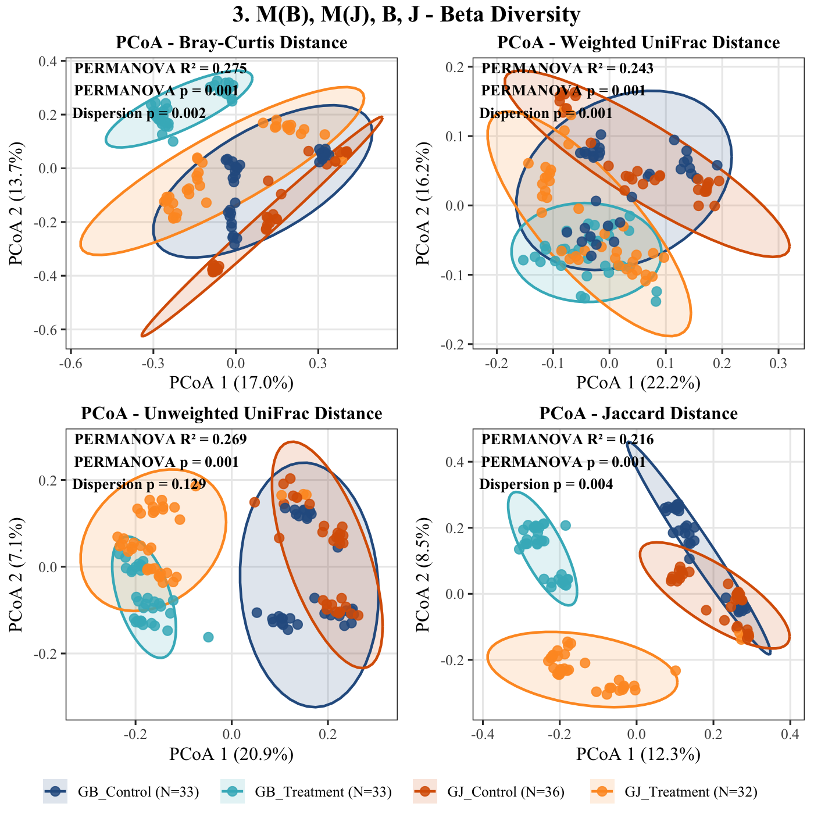
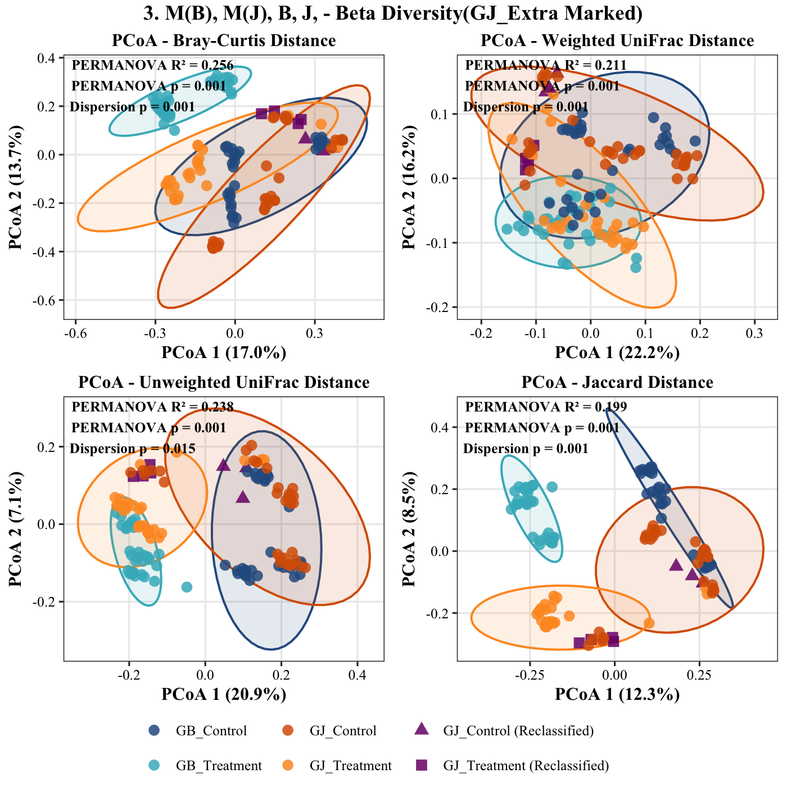
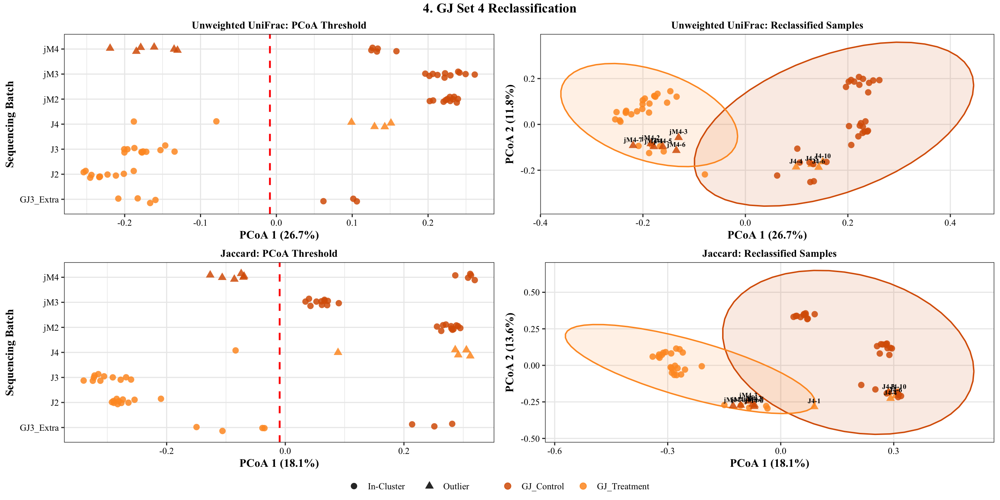
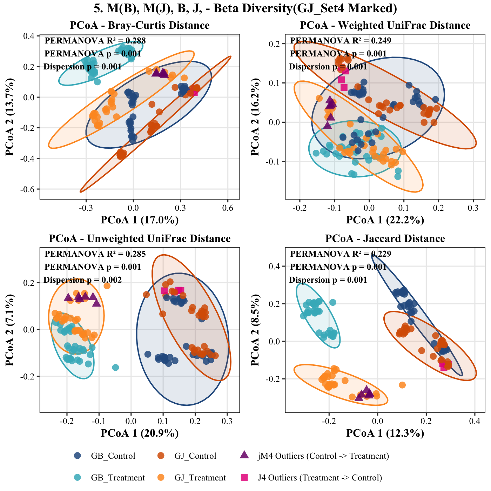
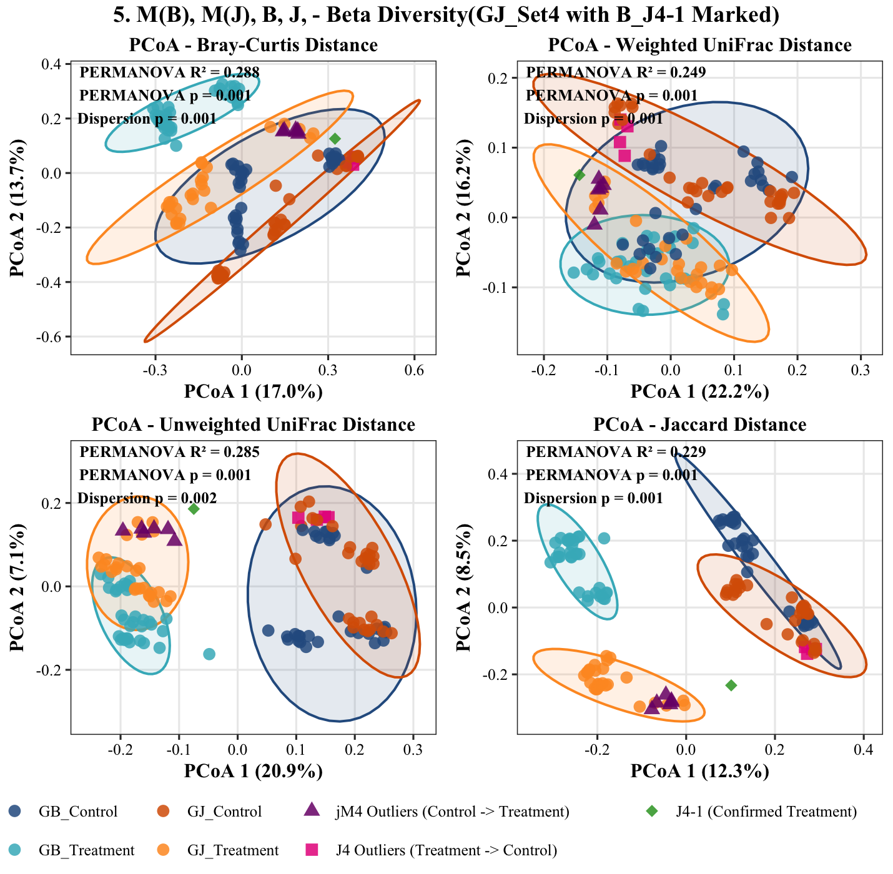
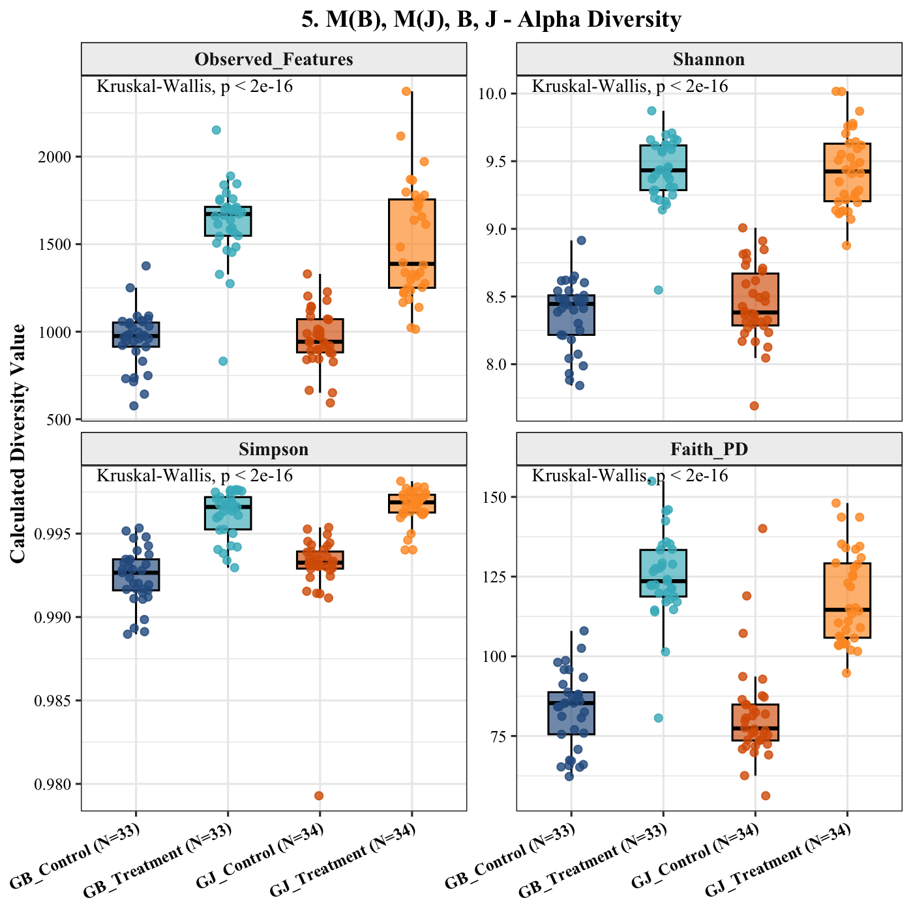
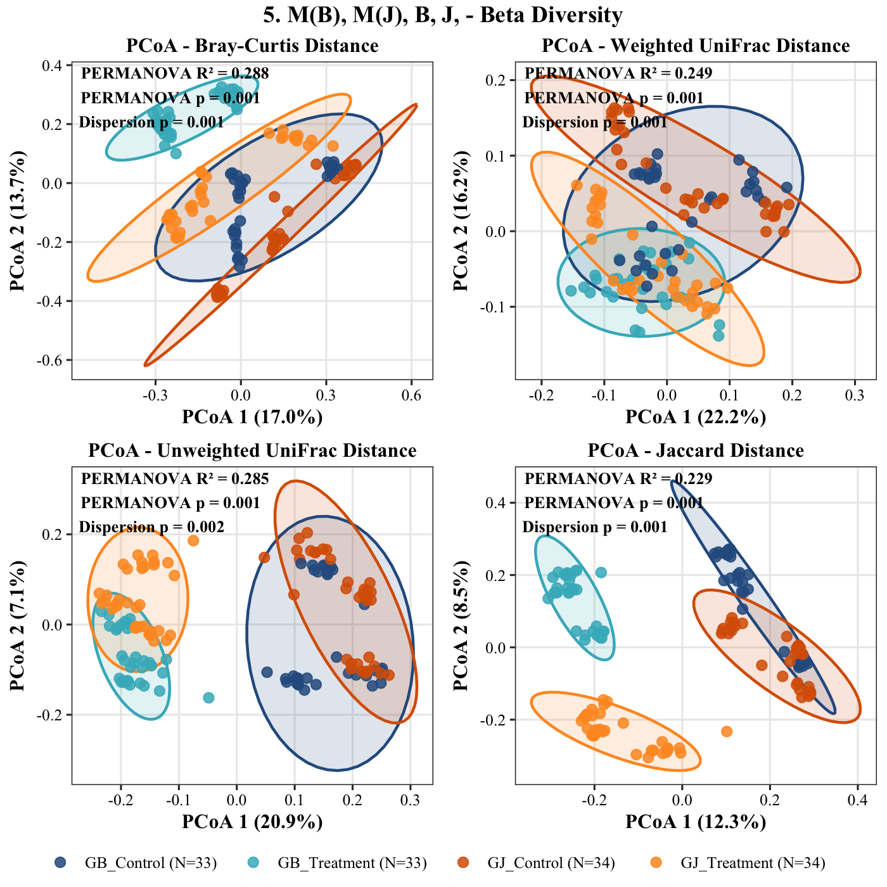

# Ordination-Guided Sample Deconvolution and Forensic Reclassification of GJ Cohort Mislabeling
**Date:** July 24, 2026  
**Project:** 04_MicroTom_P_Rhizosphere_Amplicon_Analysis  
**Target Assays:** Bacterial 16S rRNA (V3–V4)  
**Platform:** R v4.6.1 (`aarch64-apple-darwin23`, Native ARM64)  
**Input Artifacts:** `07_diversity_16S/full/*`, `metadata_P_generation.tsv`  
**Output Artifacts:** `metadata_P_generation_corrected_final.tsv`  

---

## 1. Methodological Rationale & Algorithmic Strategy

In controlled greenhouse mesocosms, continuous soil suspension treatments drive reproducible taxonomic succession in the rhizosphere. When technical labeling errors occur during physical harvest, the resulting microbial profile does not represent an intermediate biological state; rather, its high-dimensional feature composition clusters deterministically with its true biological treatment centroid.

To resolve sample identity ambiguities without introducing subjective bias, we implemented an **unsupervised ordination-guided deconvolution pipeline**:

1. **Orthogonal Axis Decomposition:** Principal Coordinate Analysis (PCoA) across presence-absence ecological distance spaces (Unweighted UniFrac and Jaccard) projects maximal variance between uninoculated peat controls and soil suspension treatments along PCoA Axis 1.
2. **Centroid Thresholding:** A decision boundary is established at the geographic midpoint between the empirical centroids of verified control and treatment libraries:
   $$\theta = \frac{\mu_{\text{Control}} + \mu_{\text{Treatment}}}{2}$$
   where $\mu$ represents the mean coordinate on PCoA 1.
3. **Multi-Metric Consensus Verification:** A sample is marked for reclassification if and only if its coordinate crosses $\theta$ across multiple orthogonal distance metrics, preventing metric-specific mathematical artifacts from dictating biological reassignment.

---

## 2. Phase 1: Extra Sample ($x/y$) Deconvolution & Sample Size Discrepancy

Initial inspection of the 7 ambiguous samples bearing terminal suffixes `x` and `y` from cohort `GJ3_Extra` demonstrated clean bimodal partitioning along PCoA Axis 1.

_Reclassification.png)

### Bimodal Partitioning Analysis
* **Treatment Partition:** Samples `B_J2y`, `B_J5y`, `B_J7x`, and `B_J8x` mapped strictly to the negative coordinate space of PCoA 1 alongside verified `GJ_Treatment` libraries across both Unweighted UniFrac ($26.7\%$ variance explained) and Jaccard ($18.1\%$ variance explained).
* **Control Partition:** Samples `B_J2x`, `B_J5x`, and `B_J13x` crossed the decision boundary ($\theta$) into positive coordinate space, clustering with `GJ_Control`.





### Structural Imbalance Identified
Following the initial reclassification of the 7 Extra samples:
* While ordination trajectories tightened, group sample allocations yielded an unexpected asymmetry: **`GJ_Control (N=36)` vs. `GJ_Treatment (N=32)`**.
* The balanced experimental design specified 11 biological replicates per experimental set ($3\times 11 = 33$ nominal replicates per condition, plus rescued extras). An excess of controls alongside a deficit of treatments indicated that physical mislabeling was not restricted to the `x`/`y` tubes, but extended systematically into the standard harvest tubes of set 4 (`J4` and `jM4`).

---

## 3. Phase 2: Systematic Outlier Audit of GJ Set 4

To evaluate systematic tube swaps during the harvest of set 4, we implemented the automated boundary extraction function `extract_all_gj_outliers()` across the entire Gyeongju cohort.



### Metric Concordance Diagnostics

```text
======================================================================
          GJ SET 4 OUTLIER SAMPLE NAME VERIFICATION REPORT            
======================================================================

--- 1. GJ_Control Outliers (jM4 Set, N = 6 ) ---
  sample-id      PCoA1 Sequencing_Batch Generation
1   B_jM4-2 -0.1846844              jM4          P
2   B_jM4-3 -0.1303587              jM4          P
3   B_jM4-4 -0.1788205              jM4          P
4   B_jM4-5 -0.1611927              jM4          P
5   B_jM4-6 -0.1348104              jM4          P
6   B_jM4-7 -0.2192077              jM4          P

--- 2. GJ_Treatment Outliers (J4 Set, N = 4 ) ---
  sample-id      PCoA1 Sequencing_Batch Generation
1   B_J4-10 0.15105450               J4          P
2    B_J4-3 0.12931789               J4          P
3    B_J4-4 0.09897859               J4          P
4    B_J4-6 0.14290620               J4          P

======================================================================
                     METRIC CONCORDANCE ANALYSIS                      
======================================================================
[GJ_Control]  : 100% MATCH CONFIRMED across Unweighted UniFrac & Jaccard.
               Samples to reclassify (Control -> Treatment):
               B_jM4-2, B_jM4-3, B_jM4-4, B_jM4-5, B_jM4-6, B_jM4-7

[GJ_Treatment]: MISMATCH DETECTED between metrics!
======================================================================
```

* **Control-to-Treatment Inversion ($N=6$):** Six samples labeled `jM4` (`B_jM4-2` through `B_jM4-7`) exhibited extreme displacement toward the treatment centroid (PCoA 1 coordinates between $-0.130$ and $-0.219$), confirming a 100% match across Unweighted UniFrac and Jaccard. These represent physical Gyeongju soil treatments labeled with control tubes.
* **Treatment-to-Control Inversion ($N=4$):** Four samples labeled `J4` (`B_J4-3`, `B_J4-4`, `B_J4-6`, `B_J4-10`) crossed into positive control territory (PCoA 1 coordinates between $+0.098$ and $+0.151$).

---

### Resolving the `B_J4-1` Boundary Ambiguity

The diagnostic report indicated a metric mismatch for `GJ_Treatment`. While Jaccard flagged sample `B_J4-1` near the decision boundary, evaluating all four complementary beta-diversity spaces resolved its identity.





* **Phylogenetic & Quantitative Clustering:** In Unweighted UniFrac ($R^2 = 0.285$), Weighted UniFrac ($R^2 = 0.249$), and Bray-Curtis ($R^2 = 0.288$), `B_J4-1` (green diamond) clusters within the core `GJ_Treatment` 95% confidence ellipse.
* **Biological Decision:** `B_J4-1` was confirmed as an authentic Treatment replicate and retained within `GJ_Treatment`. Only the 4 concordant outliers (`B_J4-3`, `B_J4-4`, `B_J4-6`, `B_J4-10`) were reclassified to `GJ_Control`.

---

## 4. Phase 3: Final Curated Cohort Architecture & Diversity Verification

Applying the two-phase forensic reclassification restored sample allocations across all experimental groups:
* **Gijang B:** $N = 33$ Control, $N = 33$ Treatment
* **Gyeongju:** $N = 34$ Control, $N = 34$ Treatment ($36 - 6 + 4 = 34$ Control; $32 + 6 - 4 = 34$ Treatment)
* **Total Cohort Size:** Balanced $N = 134$ sequencing libraries.



### Alpha Diversity Profiles Post-Correction
* **Variance Stabilization:** Within-group dispersion contracted across all four indices. Kruskal-Wallis tests confirm robust separation ($p < 2 \times 10^{-16}$ across Observed Features, Shannon, Simpson, and Faith's PD).
* **Biological Response:** Peat plug controls maintain baseline richness ($\sim 950\text{--}1000$ ASVs), whereas both Gijang B and Gyeongju soil suspensions expand rhizosphere richness to $\sim 1500\text{--}1700$ ASVs.



### Beta Diversity Ordination Post-Correction
* **Multivariate Separation:** Explanatory power across treatment groups increased substantially:
  * **Bray-Curtis:** $R^2 = 0.288$, $p = 0.001$
  * **Weighted UniFrac:** $R^2 = 0.249$, $p = 0.001$
  * **Unweighted UniFrac:** $R^2 = 0.285$, $p = 0.001$
  * **Jaccard:** $R^2 = 0.229$, $p = 0.001$
* **Centroid Cleanliness:** Outliers bridging the inter-treatment void were eliminated. Control and treatment cohorts formed distinct, non-overlapping clusters while preserving the biological divergence between regional soil lineages along Axis 2.

---

## 5. Sample Reclassification Registry

| Original Tube Label | Physical Batch | Diagnostic PCoA 1 Coordinate | Initial Assignment | Final Curated Assignment | Reclassification Basis |
| :--- | :--- | :--- | :--- | :--- | :--- |
| **B_J2x** | `GJ3_Extra` | $+0.264$ | `GJ_Treatment_Extra` | **`GJ_Control`** | Unweighted UniFrac + Jaccard Consensus |
| **B_J5x** | `GJ3_Extra` | $+0.248$ | `GJ_Treatment_Extra` | **`GJ_Control`** | Unweighted UniFrac + Jaccard Consensus |
| **B_J13x** | `GJ3_Extra` | $+0.211$ | `GJ_Treatment_Extra` | **`GJ_Control`** | Unweighted UniFrac + Jaccard Consensus |
| **B_J2y** | `GJ3_Extra` | $-0.176$ | `GJ_Treatment_Extra` | **`GJ_Treatment`** | Unweighted UniFrac + Jaccard Consensus |
| **B_J5y** | `GJ3_Extra` | $-0.169$ | `GJ_Treatment_Extra` | **`GJ_Treatment`** | Unweighted UniFrac + Jaccard Consensus |
| **B_J7x** | `GJ3_Extra` | $-0.198$ | `GJ_Treatment_Extra` | **`GJ_Treatment`** | Unweighted UniFrac + Jaccard Consensus |
| **B_J8x** | `GJ3_Extra` | $-0.182$ | `GJ_Treatment_Extra` | **`GJ_Treatment`** | Unweighted UniFrac + Jaccard Consensus |
| **B_jM4-2** | `jM4` | $-0.185$ | `GJ_Control` | **`GJ_Treatment`** | 100% Dual-Metric Outlier Match |
| **B_jM4-3** | `jM4` | $-0.130$ | `GJ_Control` | **`GJ_Treatment`** | 100% Dual-Metric Outlier Match |
| **B_jM4-4** | `jM4` | $-0.179$ | `GJ_Control` | **`GJ_Treatment`** | 100% Dual-Metric Outlier Match |
| **B_jM4-5** | `jM4` | $-0.161$ | `GJ_Control` | **`GJ_Treatment`** | 100% Dual-Metric Outlier Match |
| **B_jM4-6** | `jM4` | $-0.135$ | `GJ_Control` | **`GJ_Treatment`** | 100% Dual-Metric Outlier Match |
| **B_jM4-7** | `jM4` | $-0.219$ | `GJ_Control` | **`GJ_Treatment`** | 100% Dual-Metric Outlier Match |
| **B_J4-3** | `J4` | $+0.129$ | `GJ_Treatment` | **`GJ_Control`** | 100% Dual-Metric Outlier Match |
| **B_J4-4** | `J4` | $+0.099$ | `GJ_Treatment` | **`GJ_Control`** | 100% Dual-Metric Outlier Match |
| **B_J4-6** | `J4` | $+0.143$ | `GJ_Treatment` | **`GJ_Control`** | 100% Dual-Metric Outlier Match |
| **B_J4-10** | `J4` | $+0.151$ | `GJ_Treatment` | **`GJ_Control`** | 100% Dual-Metric Outlier Match |
| **B_J4-1** | `J4` | Boundary Case | `GJ_Treatment` | **`GJ_Treatment`** | Retained (3/4 Metrics Concordant) |