# Post-Reclassification Diversity Validation, Single-Control Benchmarking, and Taxonomic Profiling
**Date:** July 25, 2026  
**Project:** 04_MicroTom_P_Rhizosphere_Amplicon_Analysis  
**Target Assays:** Bacterial 16S rRNA (V3–V4)  
**Platform:** R v4.6.1 (`aarch64-apple-darwin23`, Native ARM64)  
**Input Artifacts:** `metadata_P_generation_corrected_final.tsv`, `05_taxonomy_16S/table_16S_clean.qza`, `06_phylo_16S/rooted_tree_16S.qza`, `07_diversity_16S/full/*`  

---

## 1. Overview & Experimental Framing

Following the two-phase forensic reclassification of the Gyeongju cohort mislabeling, the curated P-generation rhizosphere library was locked at $N = 134$ balanced biological samples:
* **Gijang B Lineage:** `GB_Control` ($N = 33$), `GB_Treatment` ($N = 33$)
* **Gyeongju Lineage:** `GJ_Control` ($N = 34$), `GJ_Treatment` ($N = 34$)

This log evaluates community diversity and taxonomic shifts under the corrected metadata. Specifically, it tests whether asynchronous control groups can be collapsed into a single reference baseline, profiles the ecological divergence between the two soil inocula, and quantifies taxonomic relative abundance at the phylum and genus levels.

---

## 2. Re-Validation of Control Asynchrony: GB_Control vs. GJ_Control

To determine whether the corrected metadata altered the relationship between the two independently grown control cohorts, alpha and beta diversity metrics were re-calculated.

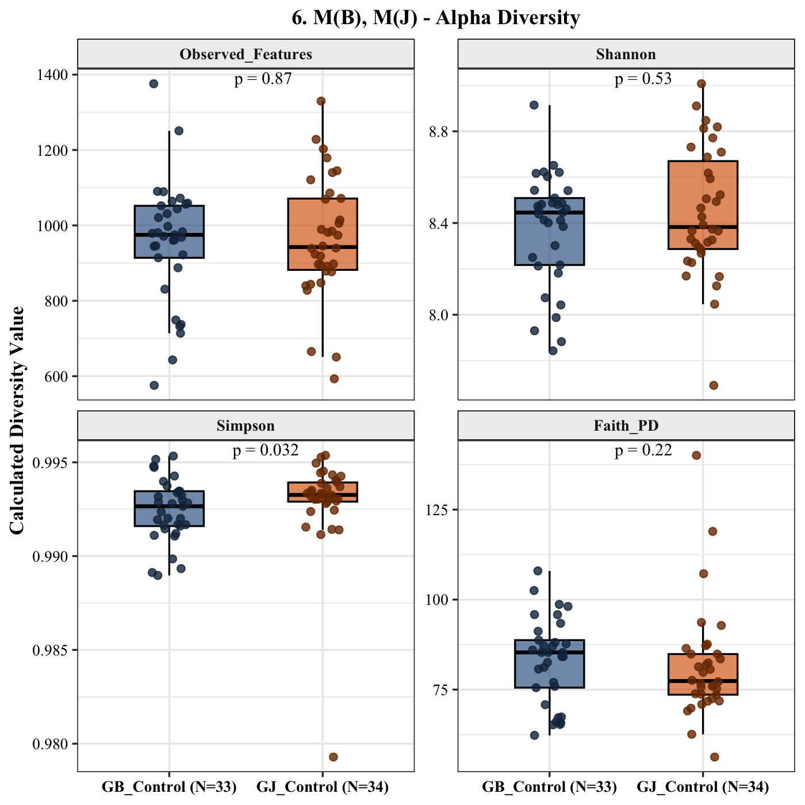

### Alpha Diversity Invariance
* **Richness & Phylogeny:** Consistent with pre-reclassification observations, uninoculated peat controls maintain statistically indistinguishable alpha diversity: Observed Features ($p = 0.87$), Shannon index ($p = 0.53$), and Faith’s PD ($p = 0.22$).
* **Dominance Structure:** Simpson diversity remains slightly divergent ($p = 0.032$), indicating subtle variations in the evenness of dominant peat-colonizing ASVs between experimental timelines.

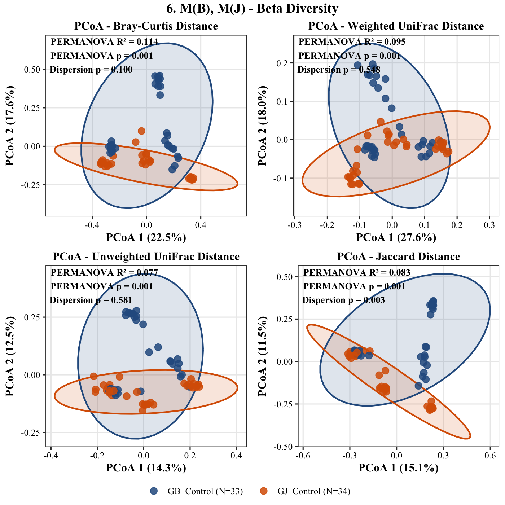

### Beta Diversity Centroid Divergence
* **Multivariate Dissimilarity:** PERMANOVA confirms that `GB_Control` and `GJ_Control` occupy statistically distinct coordinates across all four distance metrics:
  * Bray-Curtis: $R^2 = 0.114$, $p = 0.001$ (Dispersion $p = 0.100$)
  * Weighted UniFrac: $R^2 = 0.095$, $p = 0.001$ (Dispersion $p = 0.548$)
  * Unweighted UniFrac: $R^2 = 0.077$, $p = 0.001$ (Dispersion $p = 0.581$)
  * Jaccard: $R^2 = 0.083$, $p = 0.001$ (Dispersion $p = 0.003$)
* **Variance Homogeneity:** Non-significant multivariate dispersion across 3 of 4 metrics confirms that separation is driven by genuine centroid shift ($SS_A$) rather than heteroscedastic spread ($SS_W$).

---

## 3. Direct Contrast of Inoculum Lineages: GB_Treatment vs. GJ_Treatment

Evaluating the direct contrast between the two soil treatments isolates regional soil-driven selective pressures on the host rhizosphere.

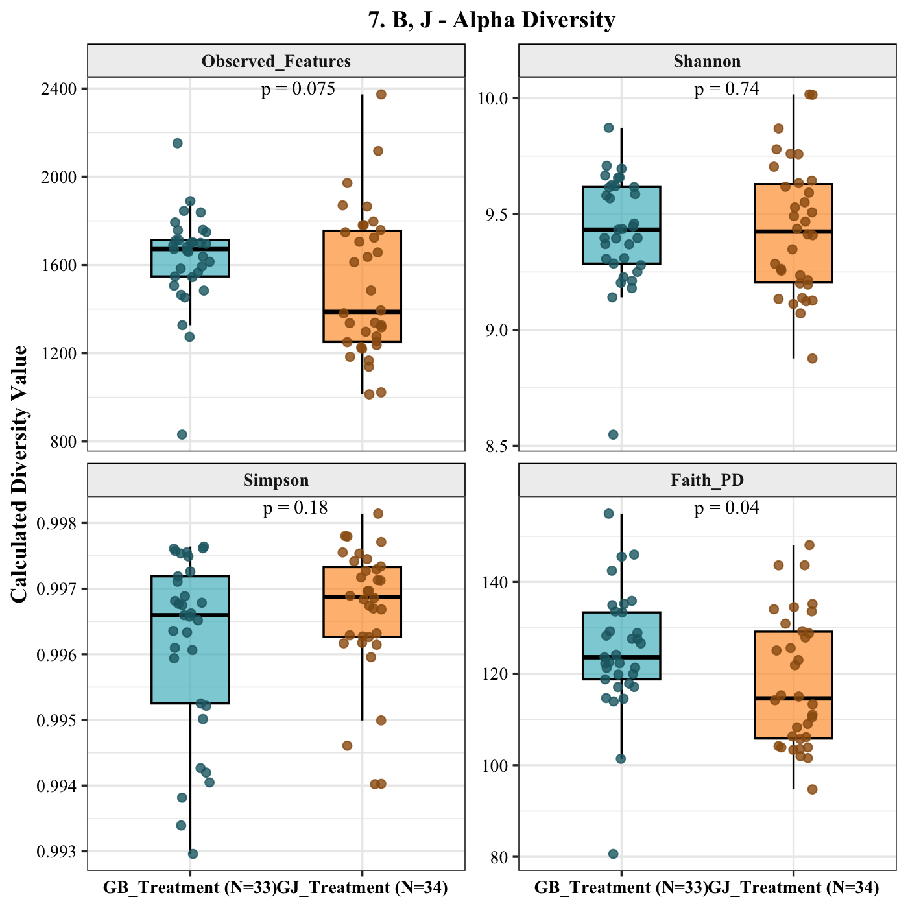

### Alpha Diversity Dynamics
* **Richness & Entropy:** Overall feature richness (Observed Features, $p = 0.075$) and Shannon entropy ($p = 0.74$) display equivalent carrying capacities between the two soil treatments, stabilizing around $\sim 1500\text{--}1700$ ASVs.
* **Phylogenetic Divergence:** Faith’s Phylogenetic Diversity reveals a significant difference ($p = 0.04$), with `GB_Treatment` supporting a slightly broader evolutionary lineage breadth than `GJ_Treatment`.

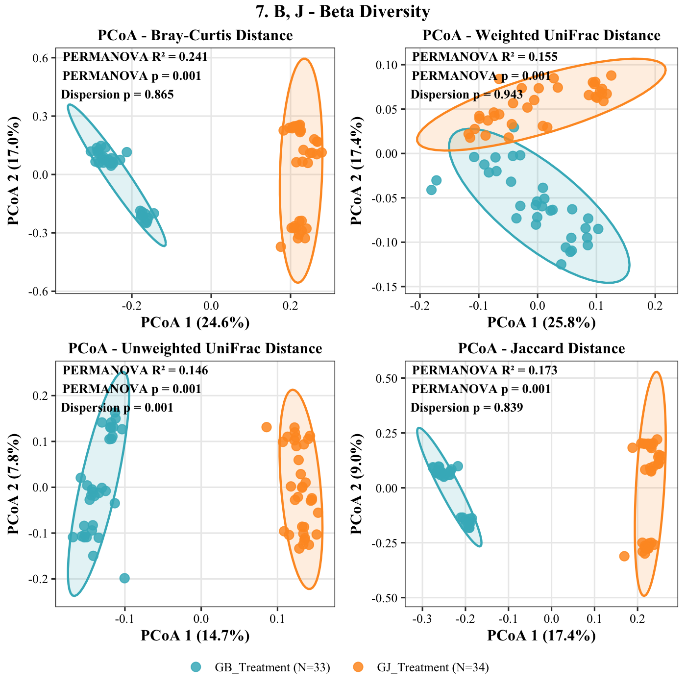

### Beta Diversity Ordination Structure
* **Lineage Separation:** The two treatments separate into distinct, non-overlapping clusters along PCoA Axis 1 ($14.7\%\text{--}25.8\%$ of total variance):
  * Bray-Curtis: $R^2 = 0.241$, $p = 0.001$ (Dispersion $p = 0.865$)
  * Weighted UniFrac: $R^2 = 0.155$, $p = 0.001$ (Dispersion $p = 0.943$)
  * Unweighted UniFrac: $R^2 = 0.146$, $p = 0.001$ (Dispersion $p = 0.001$)
  * Jaccard: $R^2 = 0.173$, $p = 0.001$ (Dispersion $p = 0.839$)
* **Ecological Specificity:** Homogeneous dispersion across quantitative and qualitative metrics proves that Gijang B and Gyeongju soil suspensions select for distinct, highly reproducible microbial equilibria in the Micro-Tom rhizosphere.

---

## 4. Single-Control Model Audit: Testing Asymmetric Baseline Validity

To assess whether a simplified model using a single control against both treatments is viable, we benchmarked tri-group ordinations using either `GB_Control` alone or `GJ_Control` alone.

### A. Model 1: GB_Control with Dual Treatments (`M(B), B, J`)

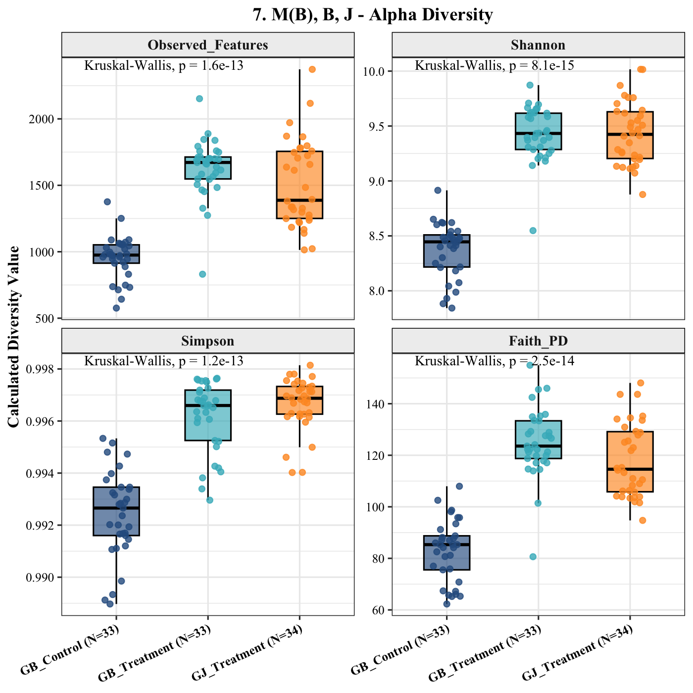

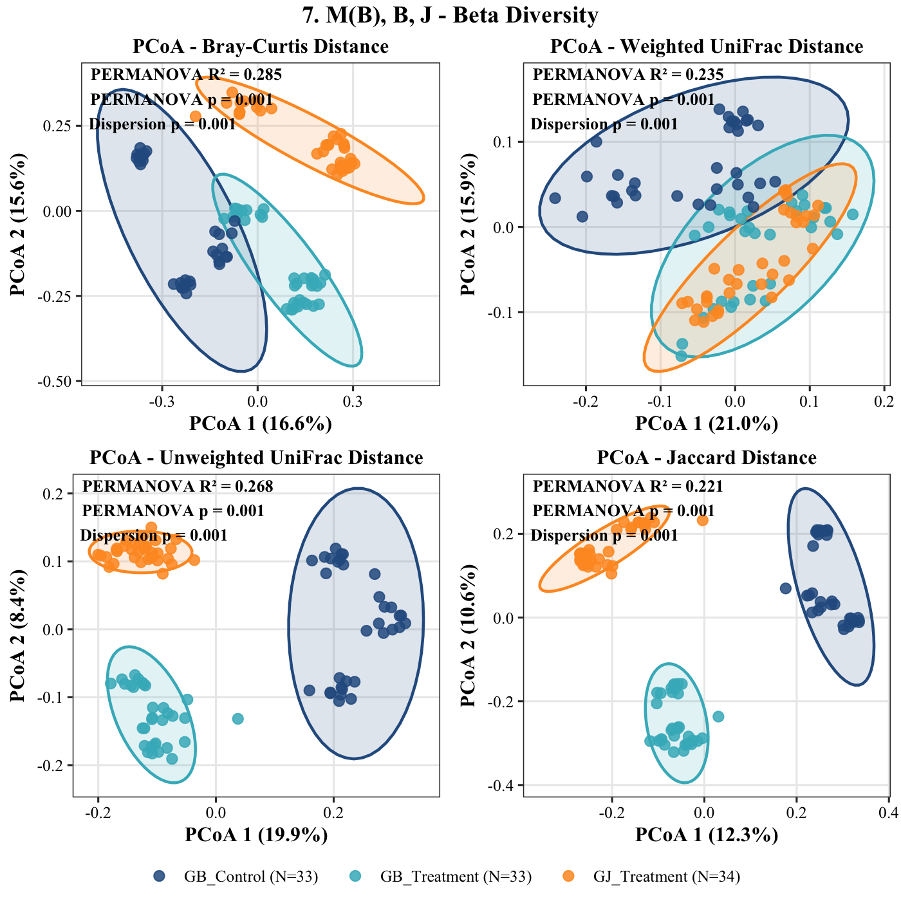

* **Alpha Diversity:** Kruskal-Wallis tests confirm strong overall treatment effects ($p < 10^{-12}$ across all metrics).
* **Beta Diversity Topology:** In PCoA space, `GB_Control` ($N=33$) clusters closer to `GB_Treatment` ($N=33$) along PCoA Axis 1 ($16.6\%\text{--}21.0\%$) and Axis 2 ($8.4\%\text{--}15.9\%$), leaving `GJ_Treatment` ($N=34$) as a distant outlier ($R^2 = 0.285$ in Bray-Curtis, $R^2 = 0.268$ in Unweighted UniFrac).

---

### B. Model 2: GJ_Control with Dual Treatments (`M(J), B, J`)

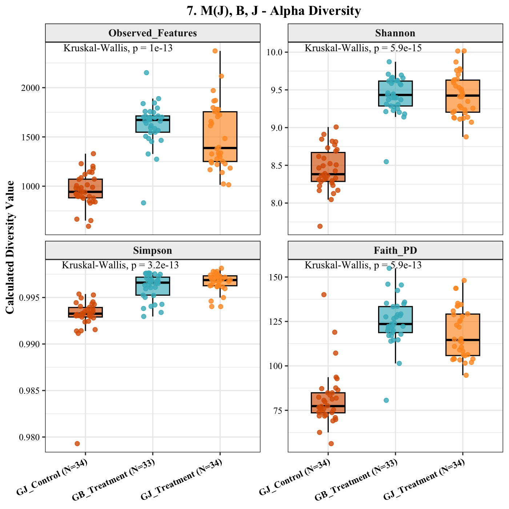

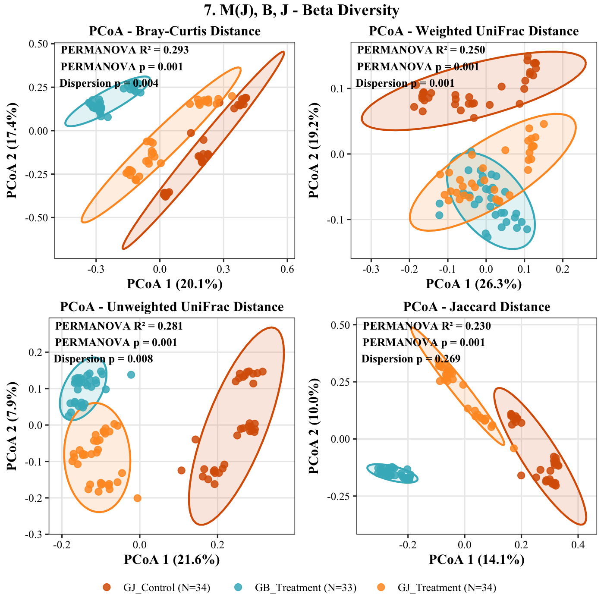

* **Alpha Diversity:** Global treatment effects remain statistically robust ($p < 10^{-12}$).
* **Beta Diversity Topology:** The spatial affinity inverts: `GJ_Control` ($N=34$) clusters closer to `GJ_Treatment` ($N=34$) across all four distance matrices, while `GB_Treatment` ($N=33$) projects as the divergent lineage ($R^2 = 0.293$ in Bray-Curtis, $R^2 = 0.281$ in Unweighted UniFrac).

### Critical Methodological Verdict
Single-control designs introduce severe asymmetric bias driven by shared temporal and batch-specific baselines:
* Peat plugs cultivated during the Gijang B timeline share baseline drift specific to the GB cohort, drawing `GB_Control` closer to `GB_Treatment`.
* Peat plugs cultivated during the Gyeongju timeline share baseline drift specific to the GJ cohort, drawing `GJ_Control` closer to `GJ_Treatment`.
* **Conclusion:** Using a single control to benchmark both treatments violates experimental exchangeability. All differential abundance testing (ANCOM-BC2) and phenotypic modeling must implement synchronous pairing:
  $$\Delta_{\text{GB}} = \text{GB\_Treatment} - \text{GB\_Control}$$
  $$\Delta_{\text{GJ}} = \text{GJ\_Treatment} - \text{GJ\_Control}$$

---

## 5. Taxonomic Composition & Rare Biosphere Expansion

Taxonomic assignments from SILVA 138 were agglomerated to quantify community architecture across experimental conditions.

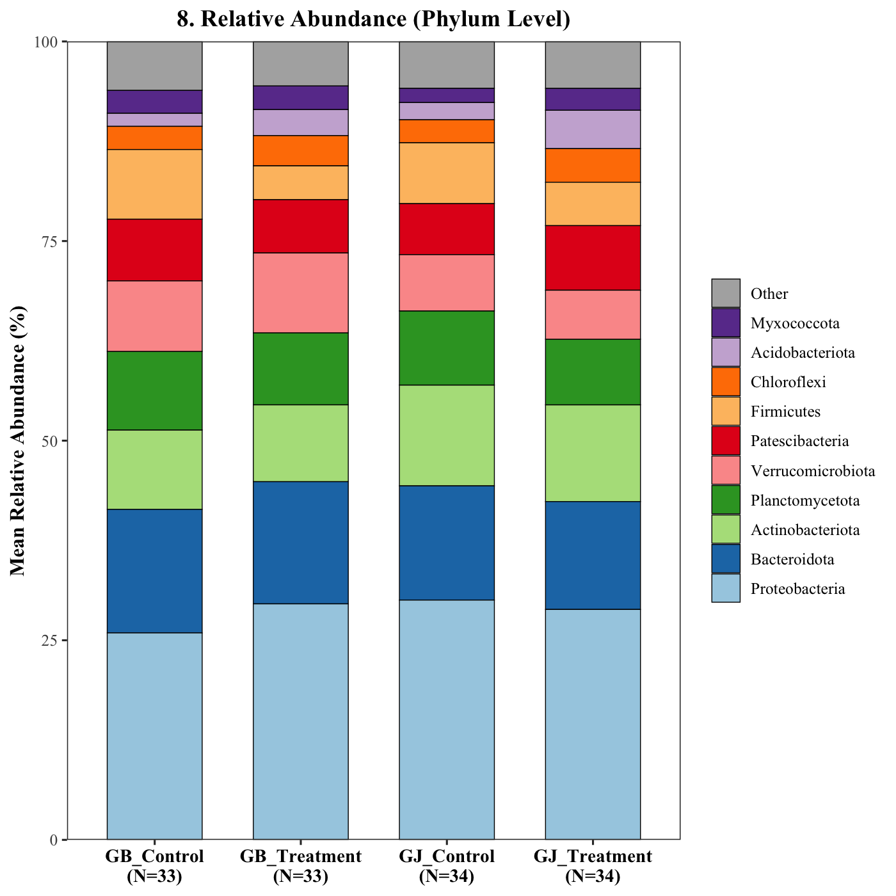

### Phylum-Level Architecture
* **Dominant Core:** The rhizosphere across all conditions is dominated by *Proteobacteria* ($26.0\%\text{--}29.8\%$), *Bacteroidota* ($13.2\%\text{--}15.2\%$), *Actinobacteriota* ($11.4\%\text{--}14.8\%$), *Planctomycetota* ($7.2\%\text{--}8.8\%$), *Verrucomicrobiota* ($7.1\%\text{--}8.3\%$), *Patescibacteria* ($6.1\%\text{--}7.4\%$), *Firmicutes* ($5.3\%\text{--}6.9\%$), *Chloroflexi* ($3.1\%\text{--}4.1\%$), *Acidobacteriota* ($2.3\%\text{--}3.1\%$), and *Myxococcota* ($2.1\%\text{--}2.8\%$).
* **Treatment-Induced Dominance Dampening:** In both control cohorts, the top 10 phyla represent $\sim 94\%$ of total community abundance. Under soil suspension treatments (`GB_Treatment` and `GJ_Treatment`), the relative abundance of dominant phyla contracts, while the "Other" fraction expands.

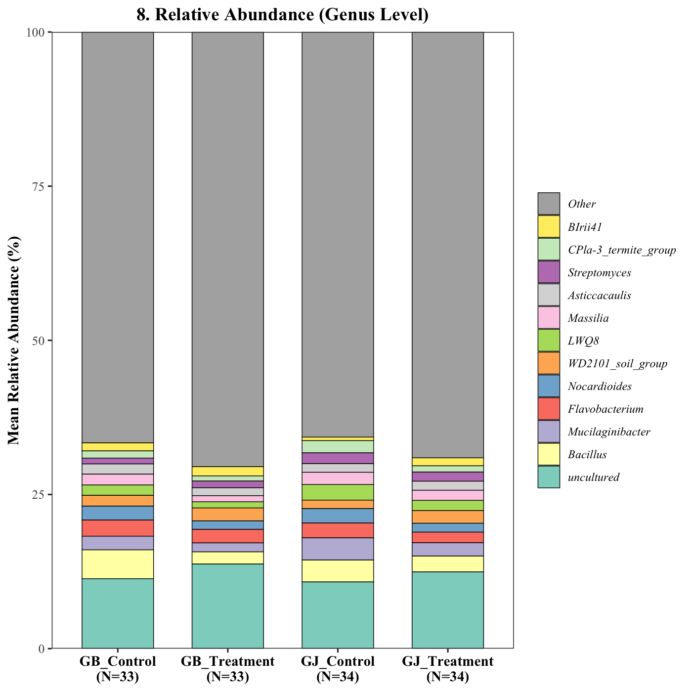

### Genus-Level Dynamics & Rare Taxa Recruitment
* **Major Genus Distribution:** The top identified genera include `uncultured` ($10.5\%\text{--}13.2\%$), *Bacillus* ($3.2\%\text{--}5.1\%$), *Mucilaginibacter* ($2.1\%\text{--}2.9\%$), *Flavobacterium* ($2.2\%\text{--}2.8\%$), *Nocardioides*, *WD2101_soil_group*, *LWQ8*, *Massilia*, *Asticcacaulis*, *Streptomyces*, *CPla-3_termite_group*, and *BIrii41*.
* **Contraction of Top Genera:** In `GB_Control` and `GJ_Control`, the top 12 genera account for **$33.6\%$ and $34.1\%$** of total abundance, leaving the unassigned "Other" fraction at $\sim 66\%$. In `GB_Treatment` and `GJ_Treatment`, the top 12 genera contract to **$29.5\%$ and $30.2\%$**, while the "Other" fraction expands to $> 70\%$.
* **Biological Mechanism:** Soil inoculation does not trigger a monodominant bloom of individual opportunists. Instead, inoculating field soil into peat plugs delivers an extensive, low-abundance "rare biosphere" that establishes within the rhizosphere, diluting the relative dominance of basal peat taxa and significantly driving up total ASV richness.

---

## 6. Differential Abundance Modeling via LinDA

To identify specific bacterial taxa driving the divergence between uninoculated peat plugs and regional soil treatments, differential abundance testing was conducted using **LinDA** (Linear Models for Differential Abundance).

### A. Methodological Justification: LinDA vs. Rank-Based Approaches
Non-parametric rank-based methods (e.g., Wilcoxon rank-sum or ANCOM rank-based heuristics) frequently break down in deeply sequenced, zero-inflated microbiome datasets:
* **Discrete Adjusted $p$-values:** Rank transformations across finite sample sizes produce tied test statistics and step-wise, discrete adjusted $p$-value distributions, obscuring the true significance gradient among highly abundant features.
* **Continuous Variance Regularization:** LinDA models log-transformed relative abundances through linear regression with an empirical bias-correction step:
  $$\log(Y_{ij} + c) = \alpha_i + \beta_i X_j + \gamma_i Z_j + e_{ij}$$
  where $Y_{ij}$ is the relative abundance of ASV $i$ in sample $j$, $X_j$ is the primary treatment indicator, $Z_j$ represents batch covariates, and $c$ is a pseudo-count. LinDA estimates compositionality-induced bias across libraries, generating continuous, well-calibrated false discovery rates (FDR-adjusted $p$-values) and continuous effect sizes ($\text{Log}_2\text{ Fold Change}$).

### B. Synchronous Pairwise Contrasts

Differential testing was structured strictly within synchronous experimental cohorts to prevent timeline-driven batch confounding:
1. **Gijang B Contrast:** `GB_Treatment (B)` vs. `GB_Control (M(B))` ($N = 33$ vs. $N = 33$)
2. **Gyeongju Contrast:** `GJ_Treatment (J)` vs. `GJ_Control (M(J))` ($N = 34$ vs. $N = 34$)

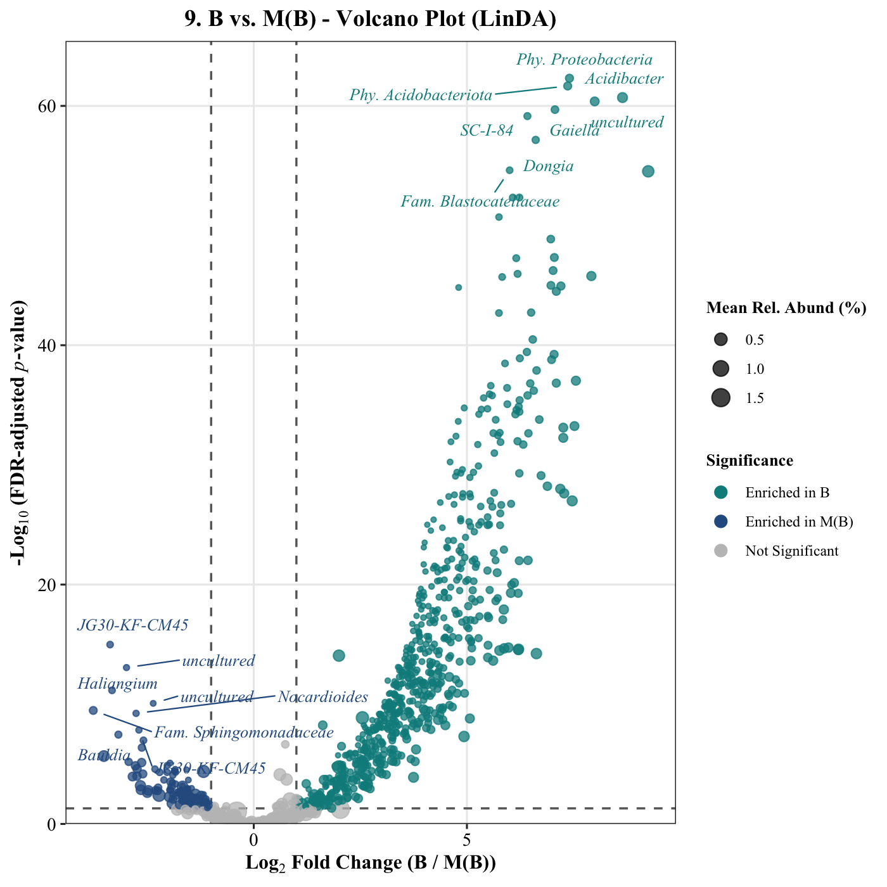

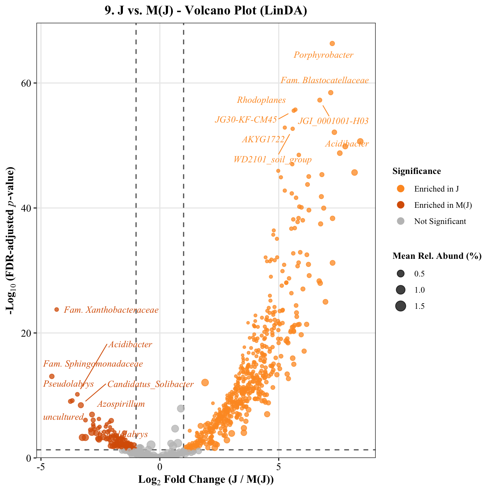

### C. Volcano Distribution Interpretation
Both volcano profiles reveal an asymmetrical expansion of taxa following soil inoculation:
* **Gijang B Biomarkers (Enriched in B):** High statistical significance ($-\log_{10}(\text{adj } p) > 40\text{--}60$) across large effect sizes ($\text{Log}_2\text{FC} > 3\text{--}6$). Top enriched lineages include *Acidibacter*, *Dongia*, *Gaiella*, *SC-I-84*, *Blastocatellaceae*, and deep clades of *Acidobacteriota* and *Proteobacteria*.
* **Gyeongju Biomarkers (Enriched in J):** Demonstrates strong statistical enrichment for distinct soil taxa, including *Porphyrobacter*, *Rhodoplanes*, *AKYG1722*, *WD2101_soil_group*, *JGI_0001001-H03*, and *JG30-KF-CM45*.
* **Peat Baseline Suppression (Enriched in Controls):** Control-enriched taxa represent baseline peat plug colonizers whose relative representation is suppressed or diluted following soil inoculation. These include *Haliangium*, *Bauldia*, *Nocardioides*, *Sphingomonadaceae*, *Pseudolabrys*, *Candidatus Solibacter*, and *Azospirillum*.

---

## 7. Comparative Heatmap Profiles (Global vs. Top 30 Biomarkers)

To decouple shared soil-responsive taxa from region-specific colonizers, $\text{Log}_2\text{FC}$ effect vectors across both contrasts were hierarchically clustered.

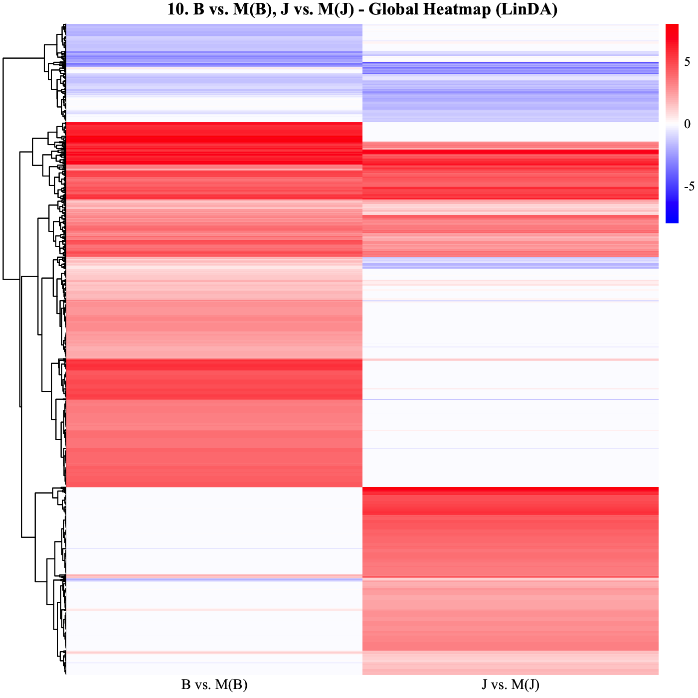

### Global Heatmap Partitioning
The global heatmap partitions the responsive microbiome into four distinct regulatory quadrants:
1. **Soil-Generalist Consortia (Co-Enriched):** Taxa displaying positive $\text{Log}_2\text{FC}$ in both `B vs. M(B)` and `J vs. M(J)`. These represent ubiquitous soil microorganisms capable of successfully invading and colonizing peat plug rhizospheres regardless of regional origin.
2. **Gijang B Specific Colonizers:** Taxa displaying high positive $\text{Log}_2\text{FC}$ in B, but neutral or near-zero fold changes in J.
3. **Gyeongju Specific Colonizers:** Taxa showing marked positive $\text{Log}_2\text{FC}$ in J, but remaining undetected or unaffected in B.
4. **Peat-Resident Clades (Suppressed):** Features exhibiting negative $\text{Log}_2\text{FC}$ across both cohorts, reflecting outcompeted baseline peat taxa.

---

### Top 30 Feature Specificity

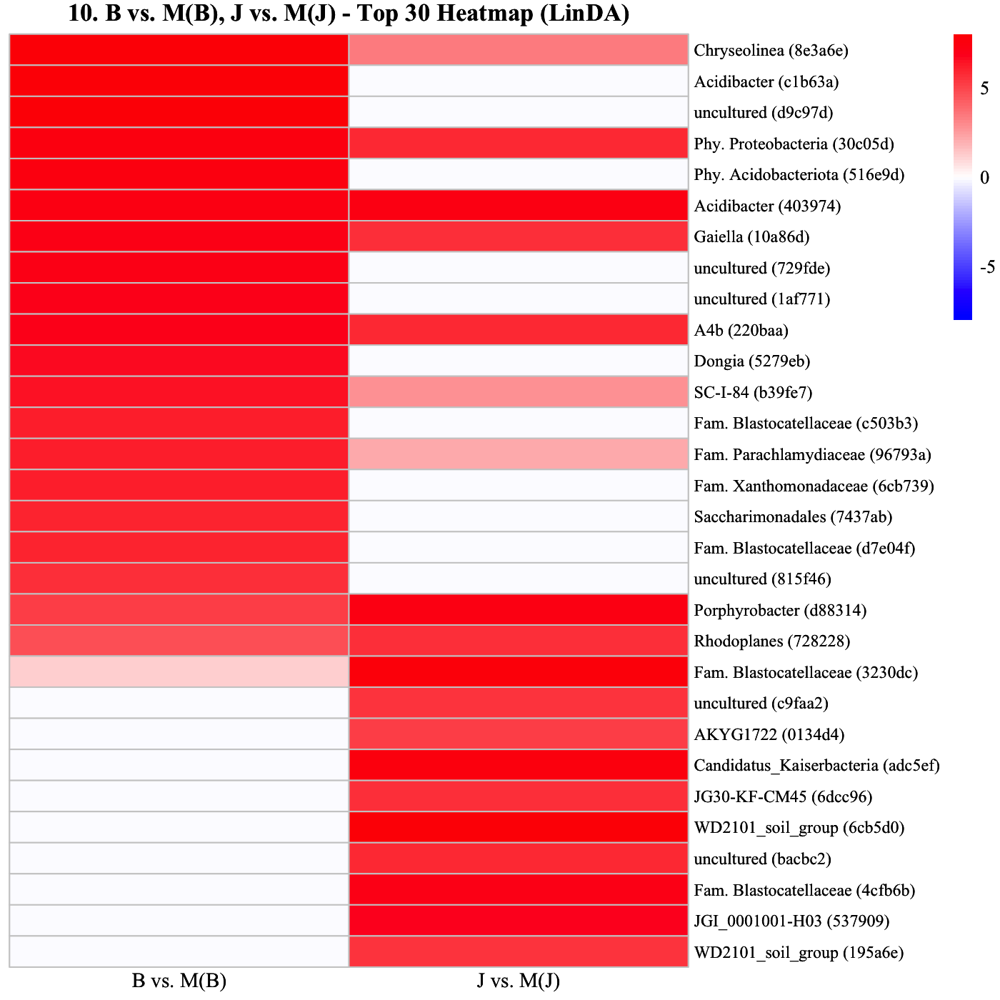

The 30 most significant features (ranked by minimum FDR-adjusted $p$-value across contrasts) isolate lineage-defining ASVs:

| Feature Identifier | Taxonomic Annotation | Effect in B vs. M(B) | Effect in J vs. M(J) | Lineage Specificity |
| :--- | :--- | :--- | :--- | :--- |
| **8e3a6e** | *Chryseolinea* | $\text{Log}_2\text{FC} \approx +5.5$ | $\text{Log}_2\text{FC} \approx +2.1$ | Dual-Enriched (B-Biased) |
| **c1b63a** | *Acidibacter* | $\text{Log}_2\text{FC} > +6.0$ | $\text{Log}_2\text{FC} \approx 0$ | **GB Exclusive** |
| **d9c97d** | *uncultured (Micropepsaceae)* | $\text{Log}_2\text{FC} > +6.0$ | $\text{Log}_2\text{FC} \approx 0$ | **GB Exclusive** |
| **30c05d** | *Phy. Proteobacteria* | $\text{Log}_2\text{FC} > +5.0$ | $\text{Log}_2\text{FC} > +4.5$ | Dual-Enriched Core |
| **10a86d** | *Gaiella* | $\text{Log}_2\text{FC} > +5.5$ | $\text{Log}_2\text{FC} \approx 0$ | **GB Exclusive** |
| **5279eb** | *Dongia* | $\text{Log}_2\text{FC} > +5.0$ | $\text{Log}_2\text{FC} \approx 0$ | **GB Exclusive** |
| **d88314** | *Porphyrobacter* | $\text{Log}_2\text{FC} \approx +1.2$ | $\text{Log}_2\text{FC} > +6.0$ | **GJ Primary** |
| **728228** | *Rhodoplanes* | $\text{Log}_2\text{FC} \approx 0$ | $\text{Log}_2\text{FC} > +5.5$ | **GJ Exclusive** |
| **3230dc** | *Fam. Blastocatellaceae* | $\text{Log}_2\text{FC} \approx 0$ | $\text{Log}_2\text{FC} > +5.5$ | **GJ Exclusive** |
| **0134d4** | *AKYG1722* | $\text{Log}_2\text{FC} \approx 0$ | $\text{Log}_2\text{FC} > +5.0$ | **GJ Exclusive** |
| **6dcc96** | *JG30-KF-CM45* | $\text{Log}_2\text{FC} \approx 0$ | $\text{Log}_2\text{FC} > +5.0$ | **GJ Exclusive** |
| **6cb5d0** | *WD2101_soil_group* | $\text{Log}_2\text{FC} \approx 0$ | $\text{Log}_2\text{FC} > +5.0$ | **GJ Exclusive** |

---

## 8. Group-Exclusive Rare Biosphere Mining

Standard differential abundance tests focus on relative abundance shifts among shared features. However, biological inocula also introduce "private" taxa that establish exclusively within a single treatment condition and remain entirely absent from uninoculated controls or competing soil treatments.

### A. Mathematical Filtering Criteria
To prevent low-depth sequencing noise or spurious read misassignments from scoring as exclusive biomarkers, strict presence-absence filters were applied:
1. **Intra-Group Presence:** Feature must be detected in $\ge 2$ biological replicates within the designated group ($N_{\text{detected}} \ge 2$).
2. **Absolute Extra-Group Absence:** Feature abundance must equal zero ($N_{\text{count}} = 0$) across all other three experimental groups:
   $$\text{Exclusive if } \text{Count}_G \ge 2 \quad \wedge \quad \sum_{G' \neq G} \text{Count}_{G'} = 0$$

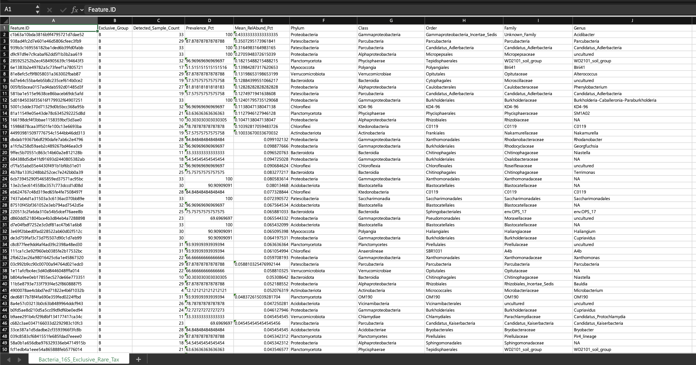

### B. High-Prevalence Private Biomarkers (Gijang B)
Analysis of `Bacteria_16S_Exclusive_Rare_Taxa_Table.tsv` demonstrates that private taxa are not transient singletons, but represent permanently colonized, treatment-defining microbial consortia:

* **ASV `c1b63a` (*Acidibacter*):** Detected in **33 out of 33 samples (100% prevalence)** in `GB_Treatment`, with a mean relative abundance of $0.443\%$. Detected in 0 samples across `M(B)`, `M(J)`, and `J`.
* **ASV `939b3c` (*Candidatus Adlerbacteria*):** Detected in **33 out of 33 samples (100% prevalence)** in `GB_Treatment` ($0.316\%$ mean abundance); completely absent in all other conditions.
* **ASV `d9c97d` (*Micropepsaceae uncultured*):** Detected in **33 out of 33 samples (100% prevalence)** in `GB_Treatment` ($0.271\%$ mean abundance); completely absent in all other conditions.
* **ASV `9382ad` (*Parcubacteria*):** Present in **29 of 33 samples (87.9% prevalence)** in `GB_Treatment` ($0.351\%$ mean abundance); absent across all other groups.
* **ASV `285925` (*WD2101_soil_group*):** Present in **32 of 33 samples (97.0% prevalence)** in `GB_Treatment` ($0.182\%$ mean abundance); absent across all other groups.

### C. Biological Implications
1. **Dispersion Dynamics:** The high prevalence ($85\%\text{--}100\%$) of multiple exclusive ASVs confirms that soil suspension inoculation successfully introduces and stabilizes exotic environmental taxa within the host rhizosphere.
2. **Functional Differentiation:** Private taxa encompass specialized oligotrophic and plant-associated clades (*Acidibacter*, *Candidatus Adlerbacteria*, *Patescibacteria*, *Blastocatellaceae*, *Planctomycetota*). These private consortia provide a candidate microbial mechanism underlying the distinct host phenotypes (accelerated ripening in GB vs. enhanced vegetative volume in GJ).