# Publication-Quality 16S Diversity Profiling on Pruned Cohort (N=110)
**Date:** August 10, 2026  
**Project:** 04_MicroTom_P_Rhizosphere_Amplicon_Analysis  
**Target Assays:** Bacterial 16S rRNA (V3–V4)  
**Platform:** R v4.6.1 (`aarch64-apple-darwin23`, Native ARM64)  
**Input Artifacts:** `07_diversity_16S/core_metrics/*`, `metadata_P_generation.tsv`  

---

## 1. Experimental Framing & Visual Standardization

Following the exclusion of the compromised `GJ3` cohort (Set 4 and ambiguous $x/y$ samples), the operational bacterial library comprises $N = 110$ verified biological replicates:
* **Gijang B (GB) Lineage ($N = 66$):** `GB_Control` ($N = 33$), `GB_Treatment` ($N = 33$)
* **Gyeongju (GJ) Lineage ($N = 44$):** `GJ_Control` ($N = 22$), `GJ_Treatment` ($N = 22$)

To standardize visual hierarchy for publication, aesthetics were decoupled across two graphical channels:
1. **Marker Shape (Geographic / Batch Origin):** Circle (`pch = 16`) designates Gijang B libraries; Triangle (`pch = 17`) designates Gyeongju libraries.
2. **Color Hue & Luminance Contrast (Treatment Gradient):**
   * High-luminance, desaturated tints encode uninoculated peat controls (`GB_Control`: `#4A90E2`, `GJ_Control`: `#F87171`).
   * Low-luminance, saturated dark shades encode soil suspension treatments (`GB_Treatment`: `#1A365D`, `GJ_Treatment`: `#881337`).

---

## 2. Alpha Diversity Landscape (Pruned Baseline)

Alpha diversity distributions across the curated $N = 110$ cohort show reduced within-group dispersion compared to earlier iterations.

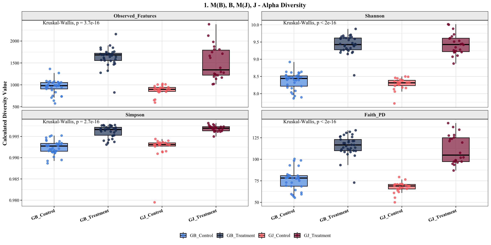

### Distributional Diagnostics
* **Statistical Significance:** Global separation remains pronounced across all indices (Kruskal-Wallis $p < 10^{-15}$):
  * Observed Features: $p = 3.7 \times 10^{-16}$
  * Shannon Index: $p < 2.0 \times 10^{-16}$
  * Simpson Index: $p = 2.7 \times 10^{-16}$
  * Faith’s Phylogenetic Diversity ($\text{PD}$): $p < 2.0 \times 10^{-16}$
* **Carrying Capacity Shifts:** Soil suspension inoculation increases feature richness from baseline peat levels ($\sim 850\text{--}1000$ ASVs) to $\sim 1400\text{--}1700$ ASVs. 
* **Cohort Tightening:** Excluding the mislabeled GJ set eliminates the previous bimodal spread in `GJ_Treatment`, producing consistent, unimodal distributions across both regional soil treatments.

---

## 3. Global Beta Diversity & Permutational Multivariate Model

Principal Coordinate Analysis (PCoA) across four complementary ecological distance spaces confirms clear separation between treatment and control centroids.

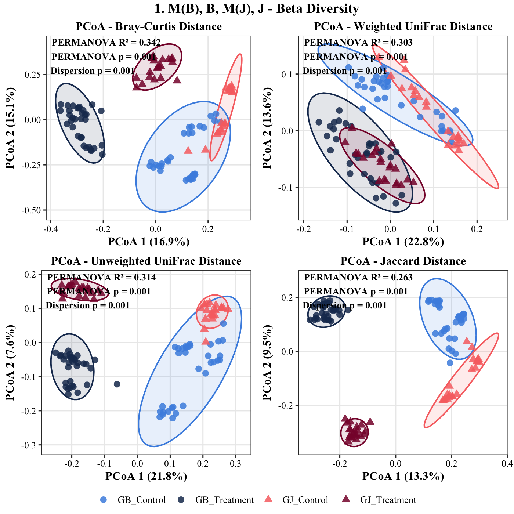

### Model Diagnostics & Variance Explained
* **Explanatory Power ($R^2$):** Excluding the ambiguous `GJ3` batch increases the variance explained by `Treatment_Group`:
  * **Bray-Curtis:** $R^2 = 0.342$, $p = 0.001$ (Dispersion $p = 0.001$)
  * **Unweighted UniFrac:** $R^2 = 0.314$, $p = 0.001$ (Dispersion $p = 0.001$)
  * **Weighted UniFrac:** $R^2 = 0.303$, $p = 0.001$ (Dispersion $p = 0.001$)
  * **Jaccard Distance:** $R^2 = 0.263$, $p = 0.001$ (Dispersion $p = 0.001$)
* **Multivariate Dispersion:** Significant dispersion tests ($p = 0.001$) reflect the biological reality that field-soil-inoculated rhizospheres occupy a broader ecological variance space than sterile, MES-irrigated peat plugs.

---

## 4. Standalone Ordination Topologies

### A. Bray-Curtis Dissimilarity (Abundance-Weighted Structure)

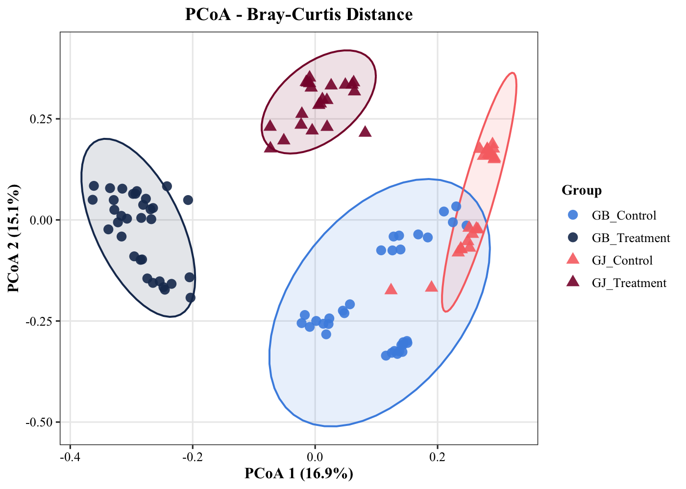

* **Axis 1 (16.9%):** Separates uninoculated control rhizospheres from soil-treated rhizospheres.
* **Axis 2 (15.1%):** Distinguishes the Gijang B community state from the Gyeongju community state.
* **Clustering:** Both treatment groups form discrete, non-overlapping clusters. While control groups align closer to one another along Axis 1, their centroids remain distinct along Axis 2, reinforcing the requirement for synchronous control pairing.

---

### B. Weighted UniFrac Distance (Quantitative Phylogenetic Shifts)

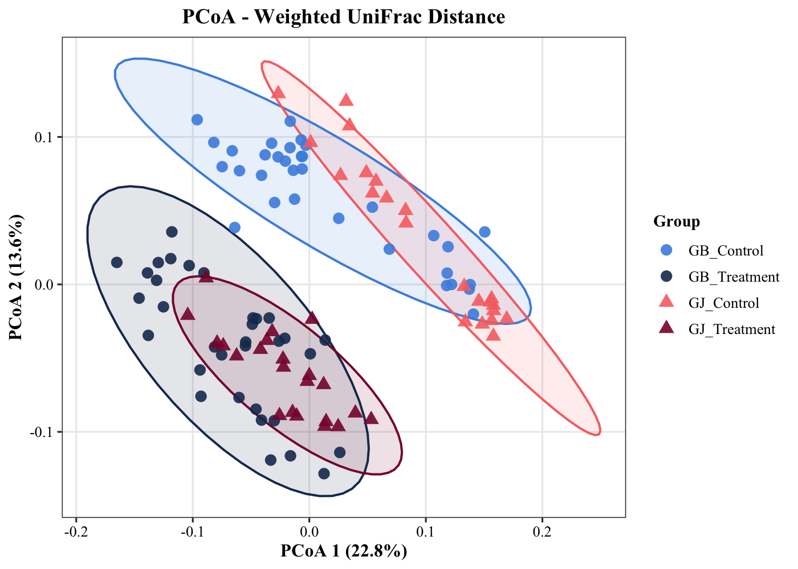

* **Axis 1 (22.8%) & Axis 2 (13.6%):** Jointly project a diagonal separation between uninoculated controls and inoculated treatments.
* **Shared Dominant Lineages:** Unlike non-phylogenetic metrics, `GB_Treatment` and `GJ_Treatment` display partial coordinate overlap in Weighted UniFrac space. This indicates that dominant bacterial clades recruited by tomato roots are largely phylogenetically conserved across both soil inocula, with regional soil differences driven primarily by secondary and rare lineages.

---

### C. Unweighted UniFrac Distance (Lineage Turnover & Phylogeny)

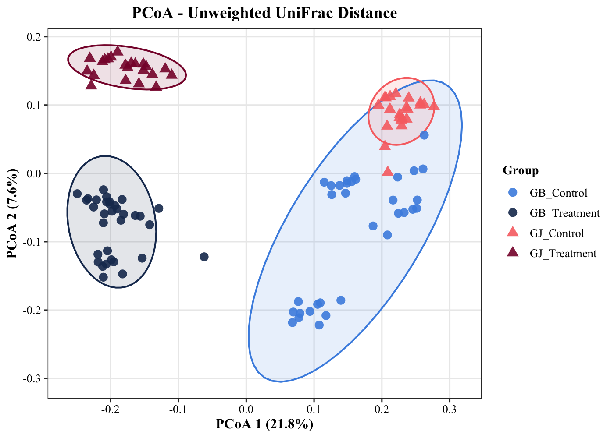

* **Axis 1 (21.8%):** Separates uninoculated controls from soil treatments.
* **Axis 2 (7.6%):** Distinguishes between the two treatment lineages.
* **Quadripartite Separation:** Incorporating evolutionary branch-length presence/absence isolates all four groups into distinct quadrants. The divergence between `GB_Treatment` (bottom-left) and `GJ_Treatment` (top-left) confirms that each soil inoculum introduces distinct phylogenetic sub-lineages that successfully establish in the rhizosphere.

---

### D. Jaccard Distance (Unweighted Feature Turnover)

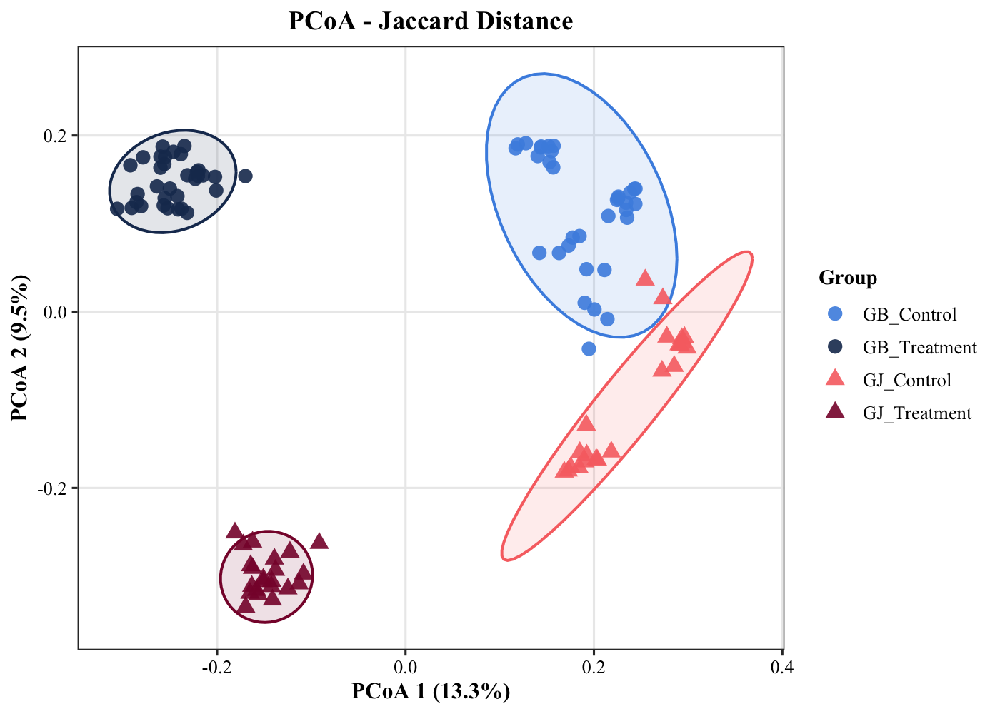

* **Axis 1 (13.3%) & Axis 2 (9.5%):** Produces four fully resolved, non-overlapping clusters.
* **Community Integrity:** Presence-absence feature turnover exhibits complete group isolation, confirming that the underlying ASV composition of each condition represents a stable, reproducible microbial assembly.

---

## 5. Non-Metric Multidimensional Scaling (NMDS) Ordination

To complement metric PCoA projections and test whether observed community separations are sensitive to linear distance assumptions, rank-based Non-Metric Multidimensional Scaling (NMDS) was executed across the four distance matrices.

.png)

### Distributional Diagnostics & Goodness of Fit
* **Stress Diagnostics:**
  * **Unweighted UniFrac:** $\text{Stress} = 0.121$ (Good fit; low risk of distance distortion).
  * **Jaccard Distance:** $\text{Stress} = 0.160$ (Usable representation with interpretable rank order).
  * **Weighted UniFrac:** $\text{Stress} = 0.196$ (Fair fit; approaching upper threshold for 2D embedding).
  * **Bray-Curtis Dissimilarity:** $\text{Stress} = 0.197$ (Fair fit; structural relationships remain concordant with PCoA).
* **Multivariate Concordance:** PERMANOVA statistics remain identical to metric evaluations ($p = 0.001$ across all metrics), confirming that group separation is driven by genuine rank-order taxonomic shifts rather than linear projection artifacts.

---

## 6. Algorithmic Comparison: Metric PCoA vs. Non-Metric MDS

| Parameter / Dimension | Metric PCoA (Classical MDS) | Non-Metric MDS (NMDS) |
| :--- | :--- | :--- |
| **Optimization Target** | Maximizes variance explained via linear projection | Preserves monotonic rank order of dissimilarities |
| **Mathematical Engine** | Spectral decomposition of centered inner-product matrix | Iterative gradient descent minimizing Kruskal's Stress |
| **Distance Preservation** | Preserves original quantitative metric distances ($D_{ij}$) | Preserves relative ranks ($D_{ij} < D_{kl} \implies d_{ij} \le d_{kl}$) |
| **Axis Interpretability** | Orthogonal axes with fixed eigenvalues (% variance) | Arbitrary coordinate axes (dimensionless; can be rotated) |
| **Zero-Inflation Tolerance** | Sensitive to non-Euclidean artifacts (negative eigenvalues) | Robust against non-linear ecological gradients and sparsity |
| **Goodness-of-Fit Metric** | Cumulative variance explained ($\sum \lambda_i / \sum |\lambda|$) | Kruskal's Stress ($S < 0.2$ considered usable) |

### Mathematical Formulations

#### 1. Principal Coordinate Analysis (PCoA)
PCoA projects a distance matrix $D \in \mathbb{R}^{n \times n}$ into Euclidean coordinate space by converting pairwise distances into an inner product matrix $B$:

$$B = -\frac{1}{2} H D^{(2)} H$$

where $H = I - \frac{1}{n}\mathbf{1}\mathbf{1}^T$ is the centering matrix, and $D^{(2)}$ contains squared dissimilarities. Spectral decomposition yields:

$$B = V \Lambda V^T$$

The coordinate matrix $X$ is computed as $X = V \Lambda^{1/2}$. Each orthogonal axis corresponds to an eigenvalue $\lambda_i$, allowing exact calculation of the percentage of total ecological variance explained:

$$\text{Variance Explained (\%)} = \frac{\lambda_i}{\sum_{j=1}^{k} \lambda_j} \times 100$$

#### 2. Non-Metric Multidimensional Scaling (NMDS)
NMDS constructs an unconstrained configuration of points in $k$ dimensions (typically $k=2$) that minimizes departure from monotonicity between original dissimilarities $D_{ij}$ and low-dimensional Euclidean distances $d_{ij}$. Using monotonic regression, fitted disparities $\hat{d}_{ij}$ are derived to compute **Kruskal's Stress ($S$)**:

$$S = \sqrt{\frac{\sum_{i < j} (d_{ij} - \hat{d}_{ij})^2}{\sum_{i < j} d_{ij}^2}}$$

Because optimization is solved iteratively via gradient descent from randomized starting configurations (`vegan::metaMDS`), coordinates lack intrinsic directionality or physical units. Goodness of fit depends entirely on minimizing residual scatter around the regression line (the Shepard diagram).

---

## 7. Standalone NMDS Cohort Topologies

### A. Bray-Curtis Dissimilarity (Abundance Ranks)

_BC.png)

* **Cluster Geography:** Rank-order mapping places `GB_Treatment` into a compact, discrete ellipse on the negative NMDS 1 axis.
* **Control Divergence:** Control groups align along the positive NMDS 1 axis, with `GB_Control` displaying vertical dispersion across NMDS 2 and `GJ_Control` forming a tight centroid, validating persistent baseline differences.

---

### B. Weighted UniFrac Distance (Abundance-Weighted Lineage Ranks)

_WUF.png)

* **Topological Overlap:** `GB_Treatment` and `GJ_Treatment` cluster closely along NMDS 2, mirroring the coordinate proximity seen in metric PCoA.
* **Biological Rationale:** Because NMDS weights rank relationships rather than absolute distances, the overlap illustrates that dominant plant-colonizing phyla (*Proteobacteria*, *Actinobacteriota*, *Bacteroidota*) share similar rank-abundance hierarchies across both soil-treated rhizospheres.

---

### C. Unweighted UniFrac Distance (Phylogenetic Turnover Ranks)

_UUF.png)

* **Lineage Resolution:** Demonstrates the lowest stress in the dataset ($S = 0.121$).
* **Quadrant Isolation:** Unweighted presence/absence of evolutionary lineages cleanly resolves the four groups: `GB_Treatment` (bottom-left), `GJ_Treatment` (top-left), and the controls occupying distinct envelopes along the right hemisphere.

---

### D. Jaccard Distance (Binary Turnover Ranks)

_JD.png)

* **Separation Fidelity:** With $S = 0.160$, ASV presence-absence turnover forms three non-overlapping, well-defined envelopes, isolating both treatments from the control baseline and from each other.

---

## 8. Direct Contrast: Gijang B vs. Gyeongju Treatments (Pruned Cohort)

To isolate regional soil inoculation effects from peat control baselines, ordination was restricted strictly to treated rhizospheres: `GB_Treatment` ($N = 33$, 3 batches) vs. `GJ_Treatment` ($N = 22$, 2 batches).

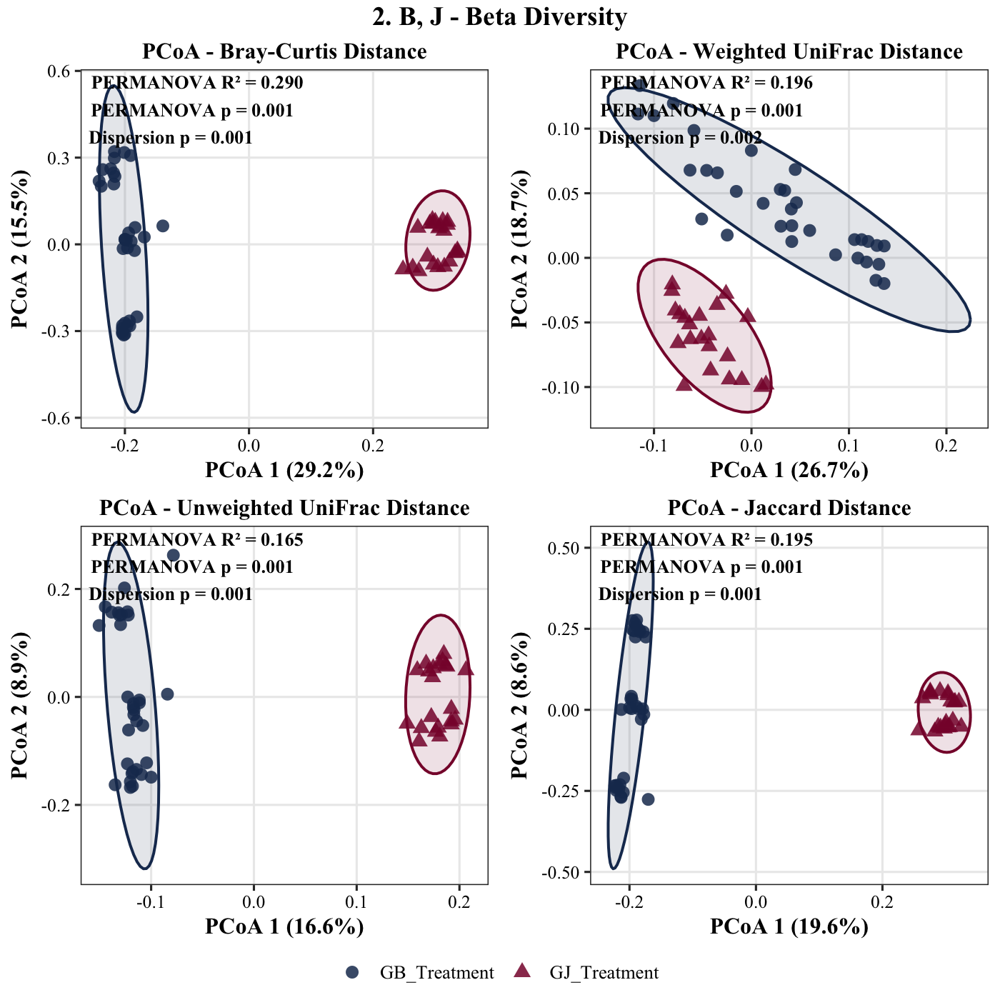

### Multivariate Model Diagnostics
* **Total Lineage Divergence:** Excluding control libraries increases the variance explained across treatments:
  * **Bray-Curtis:** $R^2 = 0.290$, $p = 0.001$ (Dispersion $p = 0.001$)
  * **Weighted UniFrac:** $R^2 = 0.196$, $p = 0.001$ (Dispersion $p = 0.002$)
  * **Jaccard Distance:** $R^2 = 0.195$, $p = 0.001$ (Dispersion $p = 0.001$)
  * **Unweighted UniFrac:** $R^2 = 0.165$, $p = 0.001$ (Dispersion $p = 0.001$)
* **Biological Interpretation:** PCoA Axis 1 separates the two soil treatments across all four metrics ($16.6\%\text{--}29.2\%$ variance explained), confirming that Gijang B and Gyeongju soils drive divergent, highly reproducible community assemblies in the Micro-Tom rhizosphere.

---

## 9. Standalone Treatment-Only PCoA Topologies

### A. Bray-Curtis Dissimilarity (29.2% on PCoA 1)

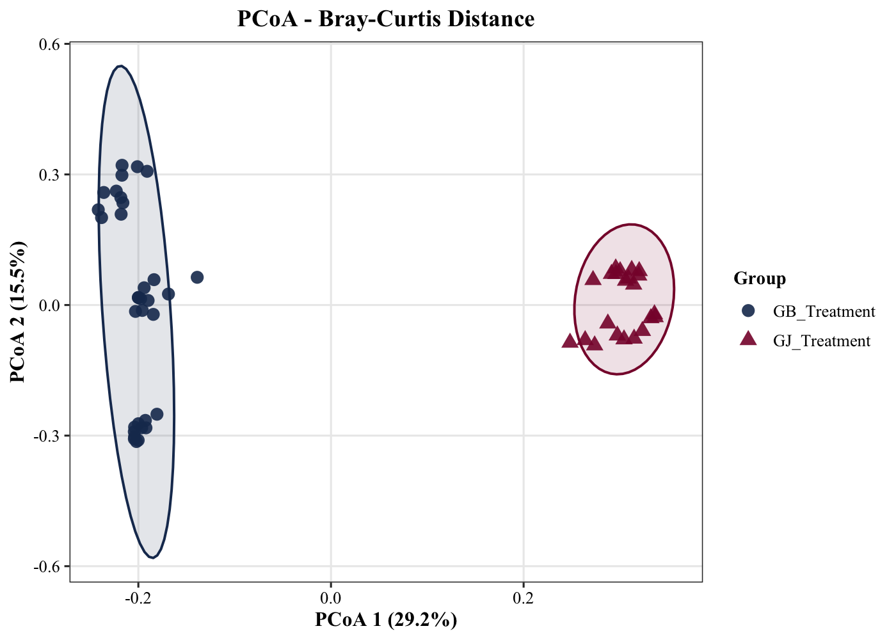

* **Axis Separation:** Axis 1 isolates `GB_Treatment` (negative) from `GJ_Treatment` (positive) with zero coordinate overlap.
* **Batch Consistency:** Vertical dispersion along Axis 2 ($15.5\%$) captures minor inter-batch variation across the three GB runs without obscuring treatment boundaries.

---

### B. Weighted UniFrac Distance (26.7% on PCoA 1)

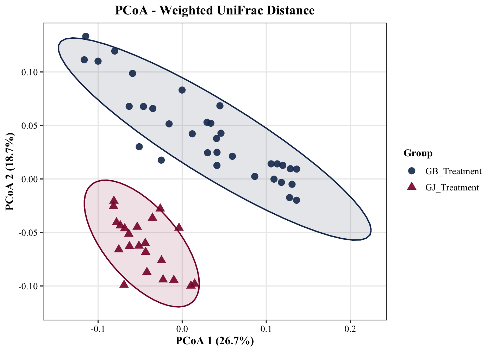

* **Quantitative Phylogenetic Divergence:** When restricted strictly to treated samples, `GB_Treatment` and `GJ_Treatment` form non-overlapping confidence ellipses ($R^2 = 0.196, p = 0.001$).
* **Lineage Weighting:** While dominant phyla are shared, their relative proportions differ sufficiently to drive complete multivariate separation.

---

### C. Unweighted UniFrac Distance (16.6% on PCoA 1)

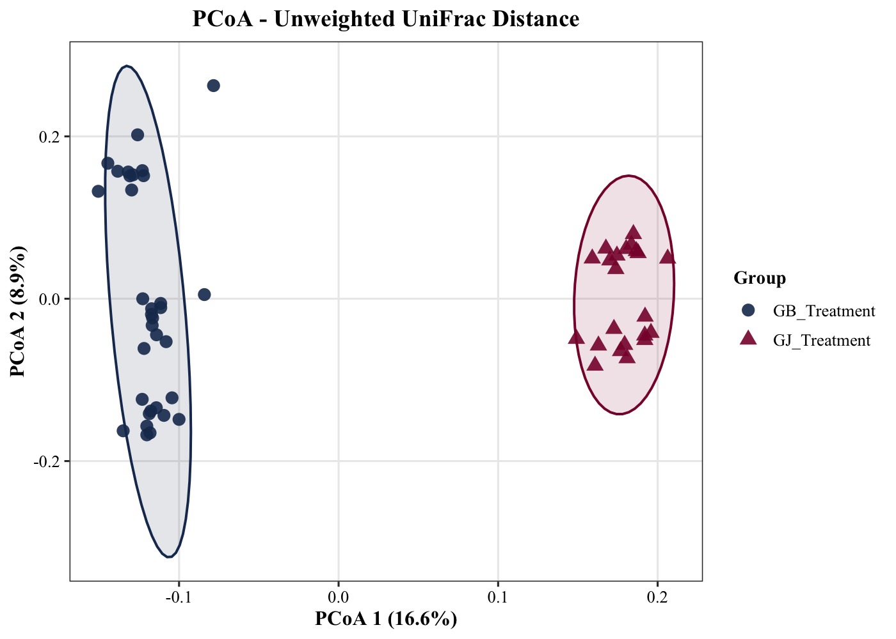

* **Phylogenetic Branch Turnover:** Complete centroid separation confirms that each soil inoculum introduces unique phylogenetic sub-clades that stably colonize the host root system.

---

### D. Jaccard Distance (19.6% on PCoA 1)

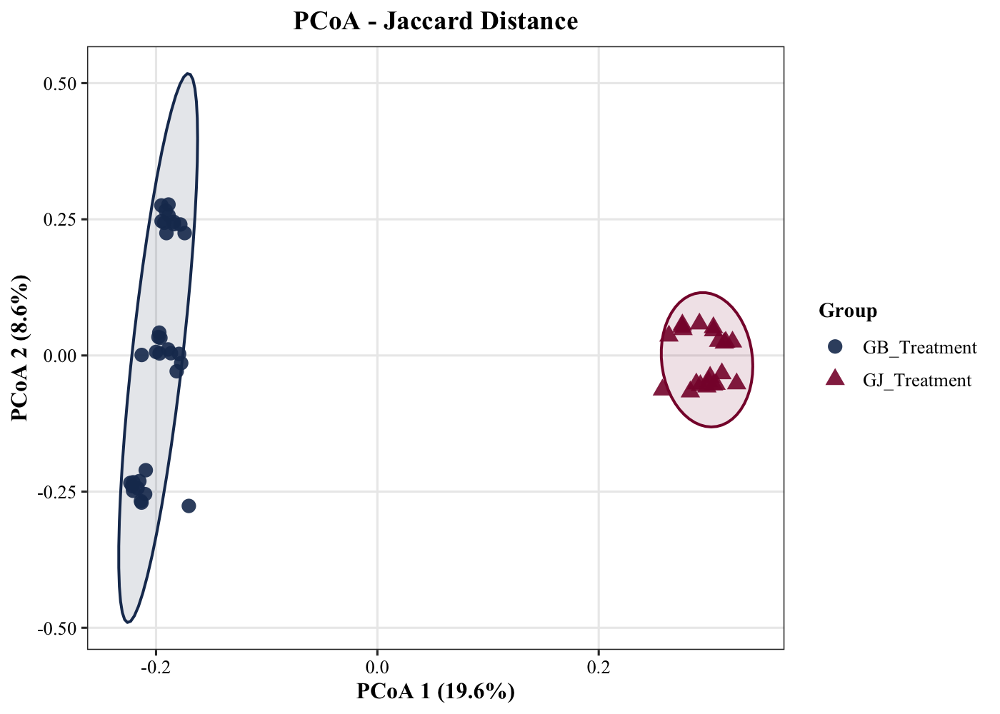

* **ASV Presence/Absence Separation:** Confirms that distinct regional soil microbiomes assemble largely non-overlapping sets of exact sequence variants in the tomato rhizosphere ($R^2 = 0.195, p = 0.001$).

---

## 10. Non-Metric Multidimensional Scaling (NMDS) of Direct Treatment Contrasts

To evaluate whether the biological divergence between `GB_Treatment` ($N = 33$) and `GJ_Treatment` ($N = 22$) is robust to non-linear ordination spaces, rank-based Non-Metric Multidimensional Scaling (NMDS) was executed across the direct contrast subset.

.png)

### Stress Diagnostics & Goodness of Fit
* **Low-Stress Rank Embedding:** Removing uninoculated control baselines eliminates large-scale dissimilarity disparities, substantially decreasing ordination stress across all four ecological metrics:
  * **Jaccard Distance:** $\text{Stress} = 0.054$ (Exceptional fit; negligible dimensional distortion).
  * **Bray-Curtis Dissimilarity:** $\text{Stress} = 0.074$ (Excellent fit; $S < 0.10$ indicates highly reliable 2D configuration).
  * **Unweighted UniFrac:** $\text{Stress} = 0.134$ (Good fit; preserves rank-order lineage distances cleanly).
  * **Weighted UniFrac:** $\text{Stress} = 0.156$ (Usable fit; monotonic rank order maintained).
* **PERMANOVA Invariance:** Non-parametric multivariate tests yield results identical to PCoA models:
  * Bray-Curtis: $R^2 = 0.290$, $p = 0.001$ (Dispersion $p = 0.001$)
  * Weighted UniFrac: $R^2 = 0.196$, $p = 0.001$ (Dispersion $p = 0.002$)
  * Jaccard Distance: $R^2 = 0.195$, $p = 0.001$ (Dispersion $p = 0.001$)
  * Unweighted UniFrac: $R^2 = 0.165$, $p = 0.001$ (Dispersion $p = 0.001$)
* **Methodological Verdict:** The complete separation between Gijang B and Gyeongju rhizosphere communities is independent of linear eigenvector projections, confirming reproducible biological divergence across both absolute metric distances and relative rank-order disparities.

---

## 11. Standalone Treatment-Only NMDS Topologies

### A. Bray-Curtis Dissimilarity (Stress = 0.074)

_BC.png)

* **Horizontal Centroid Displacement:** Complete separation along NMDS 1 isolates the Gijang B treatment cluster (negative) from the Gyeongju treatment cluster (positive).
* **Within-Treatment Dispersion:** The vertical spread of `GB_Treatment` along NMDS 2 reflects minor batch-to-batch variation across the three independent cultivation cohorts (`GB1`, `GB2`, `GB3`) without encroaching on the `GJ_Treatment` coordinate space.

---

### B. Weighted UniFrac Distance (Stress = 0.156)

_WUF.png)

* **Orthogonal Lineage Stratification:** Unlike the four-group NMDS where weighted UniFrac exhibited partial overlap with control envelopes, restricting the model strictly to treated rhizospheres resolves the two conditions into discrete, non-overlapping confidence ellipses separated across NMDS 2.
* **Abundance Weighting:** Demonstrates that quantitative shifts within shared bacterial phyla (*Proteobacteria*, *Actinobacteriota*, *Firmicutes*) are sufficiently distinct to drive rank-order separation between the two regional soil types.

---

### C. Unweighted UniFrac Distance (Stress = 0.134)

_UUF.png)

* **Phylogenetic Turnout:** Complete isolation between the two confidence ellipses confirms that each soil inoculum recruits mutually exclusive phylogenetic branches from the regional species pool into the host tomato rhizosphere.

---

### D. Jaccard Distance (Stress = 0.054)

_JD.png)

* **Discrete ASV Partitions:** Achieving an exceptionally low stress score ($S = 0.054$), Jaccard presence/absence ranks resolve into two tightly bounded, non-overlapping clusters along NMDS 1. 
* **Core Invariant:** Proves that the qualitative membership of exact sequence variants is fundamentally distinct between Gijang B and Gyeongju soils, establishing two discrete microbial regimes prior to downstream functional metagenome (PICRUSt2) and differential abundance evaluations.