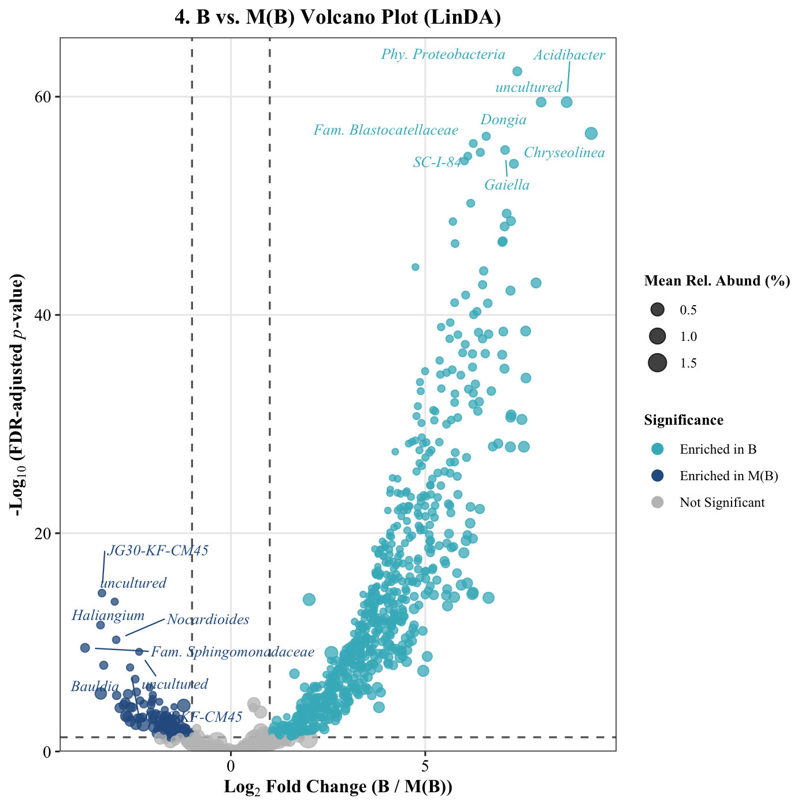
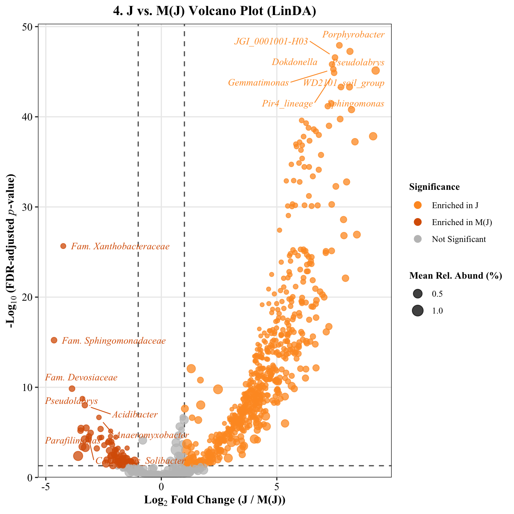
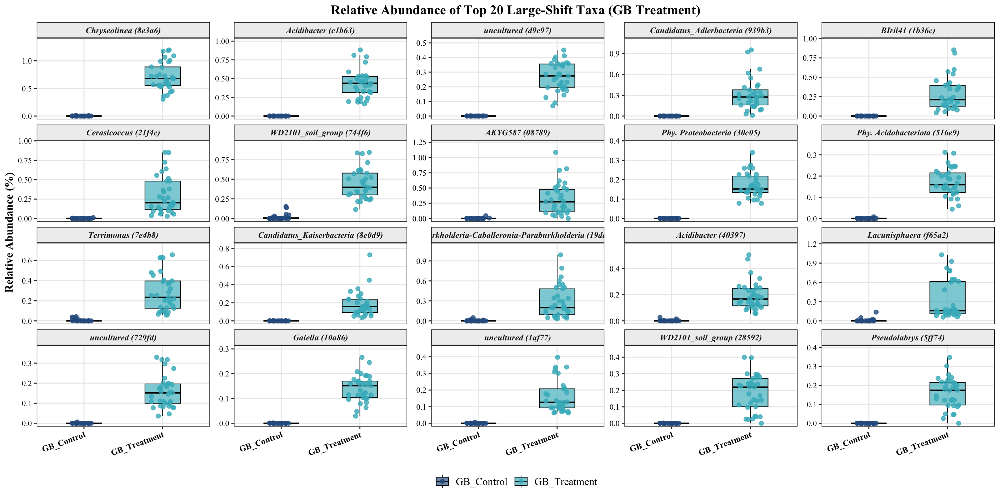
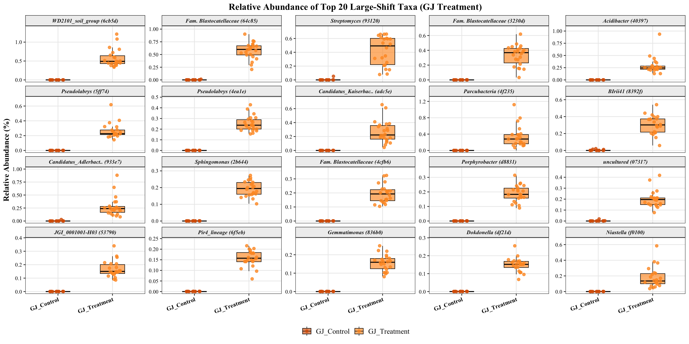
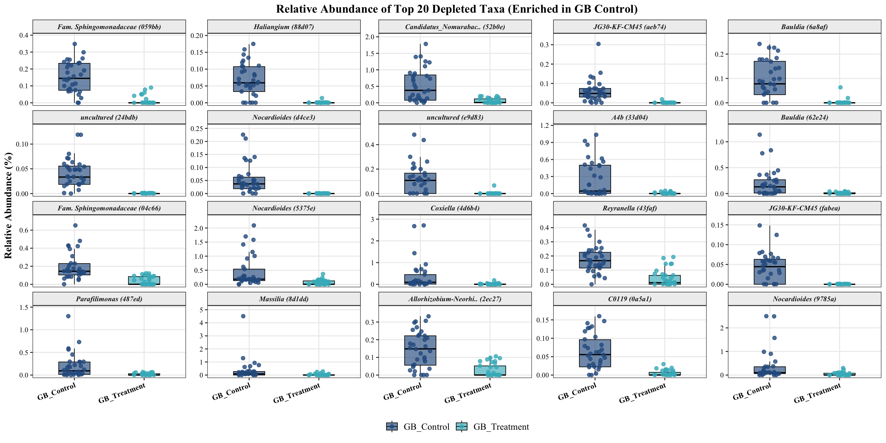
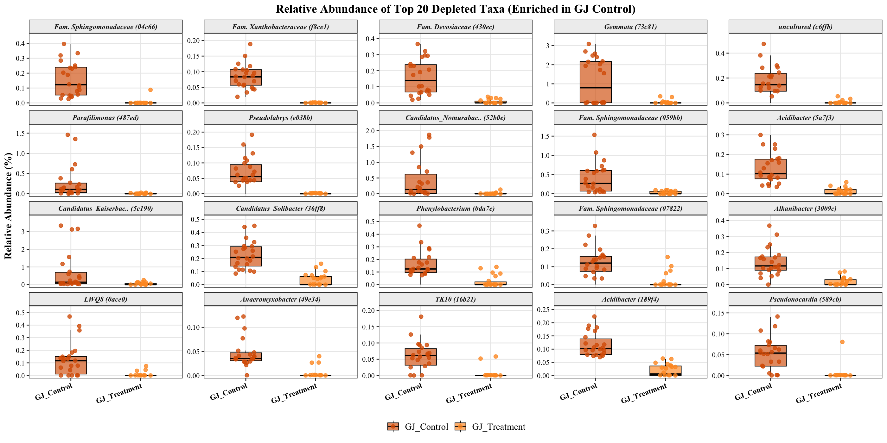
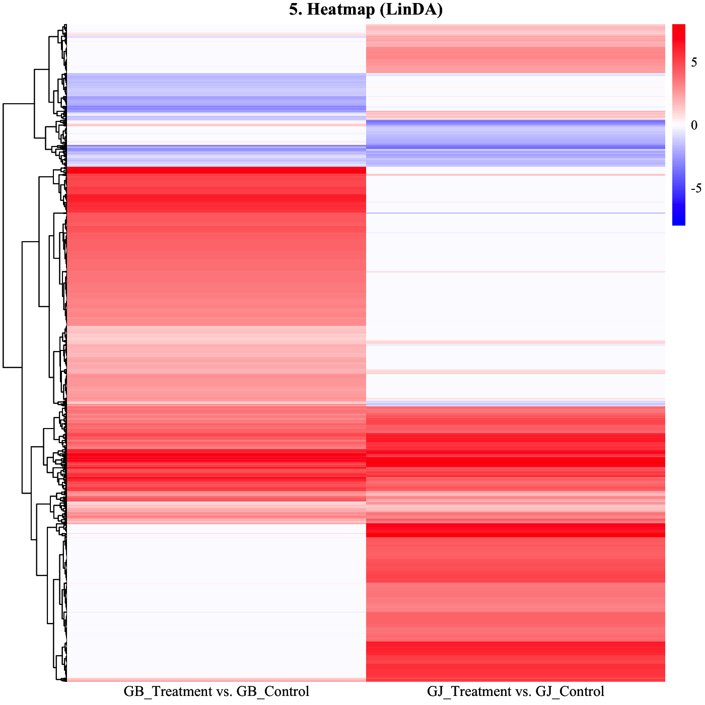
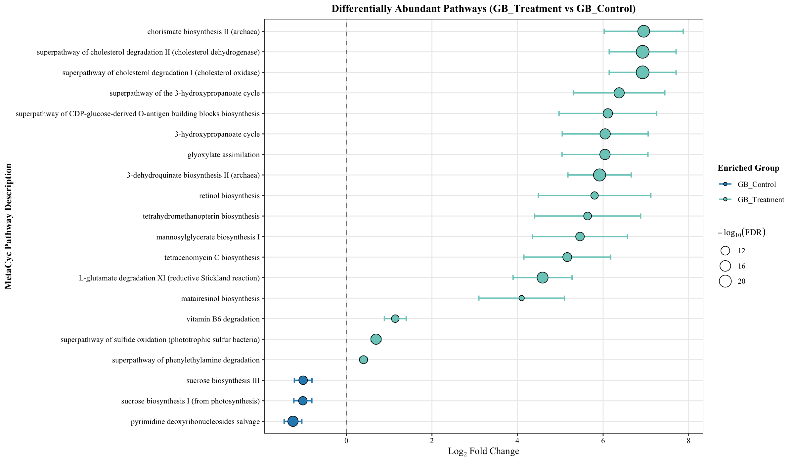
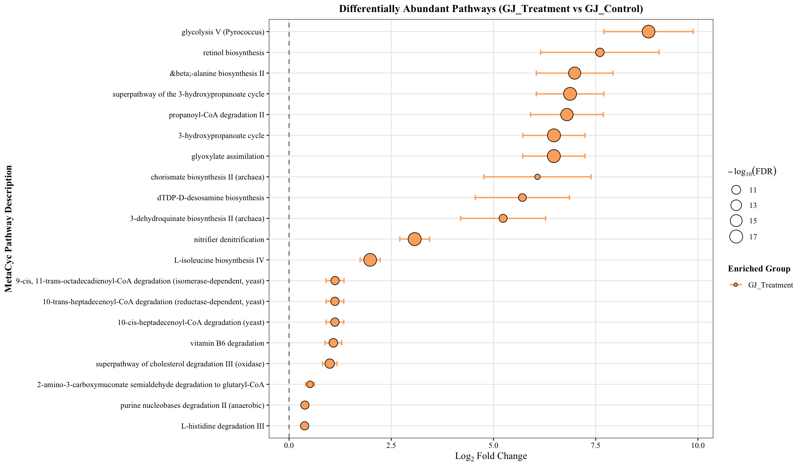

# LinDA Biomarker Deconvolution, Soil Immigrant Verification, and PICRUSt2 Functional Metagenomics
**Date:** August 24, 2026  
**Project:** 04_MicroTom_P_Rhizosphere_Amplicon_Analysis  
**Target Assays:** Bacterial 16S rRNA (V3–V4)  
**Platform:** R v4.6.1 (`aarch64-apple-darwin23`, Native ARM64) & Python 3.10  
**Input Artifacts:** `05_taxonomy_16S/table_16S_clean.qza`, `picrust2_out_16S/*`, `metadata_P_generation.tsv`  

---

## 1. Differential Abundance via LinDA (Pruned Cohort Benchmark)

Following the removal of the compromised `GJ3` batch, differential abundance testing was executed on the locked $N = 110$ cohort using **LinDA** (Linear Models for Differential Abundance). 

Synchronous pairwise contrasts evaluate treatment-specific succession against paired temporal controls:
1. **Gijang B Lineage:** `GB_Treatment` ($N = 33$) vs. `GB_Control` ($N = 33$)
2. **Gyeongju Lineage:** `GJ_Treatment` ($N = 22$) vs. `GJ_Control` ($N = 22$)

### Distributional Diagnostics
* **Gijang B Biomarker Profile (Figure 078):** Strong positive asymmetry ($\text{Log}_2\text{FC} > 3\text{--}6$) with statistical significance reaching $-\log_{10}(\text{FDR}) \approx 40\text{--}65$. Top enriched taxa include *Acidibacter*, *Dongia*, *Chryseolinea*, *Gaiella*, *SC-I-84*, *Blastocatellaceae*, and uncultured *Proteobacteria*. Peat-associated taxa depleted in B include *Haliangium*, *Bauldia*, *Nocardioides*, *Sphingomonadaceae*, and *JG30-KF-CM45*.
* **Gyeongju Biomarker Profile (Figure 079):** Significant positive shifts isolate distinct soil clades: *Porphyrobacter*, *Dokdonella*, *Pseudolabrys*, *WD2101_soil_group*, *Sphingomonas*, *Gemmatimonas*, *Pir4_lineage*, and *JGI_0001001-H03*. Depleted taxa include *Xanthobacteraceae*, *Devosiaceae*, *Parafilimonas*, *Anaeromyxobacter*, and *Candidatus Solibacter*.

---

## 2. Inoculant Verification: Origin Tracing of Enriched Taxa

To verify whether taxa displaying large positive shifts represent genuine immigrants from field soil suspensions rather than latent peat plug microbes blooming under irrigation, baseline relative abundances were quantified in uninoculated controls.

### Empirical Origin Confirmation
* **Gijang B Inoculant Colonization (Figure 080):** Across all top 20 positive-shift ASVs—including *Chryseolinea* (`8e3a6`), *Acidibacter* (`c1b63`), *uncultured Micropepsaceae* (`d9c97`), *Candidatus Adlerbacteria* (`939b3`), *BIrii41* (`1b36c`), *Cerasicoccus* (`21f4c`), and *Terrimonas* (`7c4b8`)—relative abundance in `GB_Control` is **strictly zero ($0.00\%$)** across all 33 biological replicates.
* **Gyeongju Inoculant Colonization (Figure 081):** Top positive-shift ASVs in GJ—including *WD2101_soil_group* (`6cb5d`), *Blastocatellaceae* (`64c85`, `3230d`), *Streptomyces* (`93120`), *Pseudolabrys* (`4ea1e`), *Candidatus Kaiserbacteria* (`adc5e`), *Parcubacteria* (`4f235`), *Dokdonella* (`df21d`), and *Porphyrobacter* (`d8831`)—exhibit **flat zero ($0.00\%$) baseline detection** in `GJ_Control`.

**Analytical Verdict:** The complete absence of these features in uninoculated peat controls confirms they do not originate from dormant endospores or background contaminants in the growth substrate. They represent bona fide exogenous immigrants introduced via field soil suspensions that successfully established within the tomato rhizosphere.

---

## 3. Depletion Mechanics: Absolute Elimination vs. Competitive Dilution

To establish whether negative fold changes reflect biological eradication (microbial antagonism, phage predation, or niche displacement) or mathematical dilution caused by the influx of immigrant reads, we tracked the abundance of top depleted ASVs in treated rhizospheres.

### Depletion Profiles
* **Persistent Low-Level Baselines:** In both lineages (`GB_Treatment` in Figure 082 and `GJ_Treatment` in Figure 083), the top depleted taxa—such as *Sphingomonadaceae* (`059bb`, `04c66`), *Haliangium* (`88d07`), *Bauldia* (`6a8af`), *Nocardioides* (`d4ce3`, `5375e`), *Parafilimonas* (`487ed`), and *Devosiaceae* (`43bec`)—are **not completely eradicated**. 
* **Detection Persistence:** Rather than dropping to absolute zero across all replicates, these taxa persist at low relative abundances ($0.01\%\text{--}0.05\%$) in a substantial fraction of treated plants.
* **Ecological Mechanism:** Soil suspension inoculation does not chemically sterilize or completely eliminate native peat-colonizing bacteria. Instead, the observed negative log-fold changes are driven primarily by **competitive suppression and compositional dilution**: the expansion of hundreds of newly colonized soil ASVs reduces the proportional representation of resident peat taxa without completely purging them from the root surface.

---

## 4. Cross-Lineage Biomarker Specificity & Private Taxa

Clustering LinDA $\text{Log}_2\text{FC}$ effect sizes across both contrasts decouples shared soil generalists from lineage-specific colonizers.

### Heatmap Partitioning
* **Shared Soil Generalists (Co-Enriched):** A central cluster exhibits coordinated positive fold changes in both `GB_Treatment vs. GB_Control` and `GJ_Treatment vs. GJ_Control`. These represent generalist soil bacteria capable of colonizing peat-bound tomato roots irrespective of regional soil origin.
* **Gijang B Exclusive Biomarkers:** Prominent upper block displaying strong enrichment in GB ($\text{Log}_2\text{FC} > 5$) while remaining near zero in GJ.
* **Gyeongju Exclusive Biomarkers:** Distinct lower block displaying strong enrichment in GJ while remaining undetectable in GB.
* **Suppressed Peat Consortium:** Clades exhibiting negative fold changes across both treatments, reflecting common peat-resident taxa displaced by soil-derived communities.

### Group-Exclusive Private Taxa (`Bacteria_16S_Exclusive_Rare_Taxa_Table.tsv`)
Evaluating taxa detected exclusively within a single treatment condition ($\ge 2$ replicates in target group, zero in all other three groups) confirms the presence of lineage-private consortia:
* **Gijang B Private Consortium:** High-prevalence ASVs including *Acidibacter* (`c1b63a`, 100% prevalence), *Candidatus Adlerbacteria* (`939b3c`, 100% prevalence), *uncultured Micropepsaceae* (`d9c97d`, 100% prevalence), *Parcubacteria* (`9382ad`, 87.9% prevalence), and *WD2101_soil_group* (`285925`, 97.0% prevalence).
* **Biological Relevance:** These private taxa establish stable niches exclusively within their respective soil treatment, providing candidate microbial drivers for lineage-specific host phenotypes.

---

## 5. Predicted Metagenomic Functional Profiles (PICRUSt2)

To evaluate whether taxonomic restructuring shifts the functional metabolic capacity of the rhizosphere, inferred MetaCyc pathway abundances were modeled using `ggpicrust2`.

### Functional Pathway Enrichments

| Pathway Description | MetaCyc ID / Class | Effect in GB | Effect in GJ | Biological Implication |
| :--- | :--- | :--- | :--- | :--- |
| **3-Hydroxypropanoate Cycle** | Carbon Fixation / Assimilation | $\text{Log}_2\text{FC} \approx +6.0$ | $\text{Log}_2\text{FC} \approx +6.5$ | Autotrophic/mixotrophic carbon capture |
| **Glyoxylate Assimilation** | Anaplerotic Carbon Metabolism | $\text{Log}_2\text{FC} \approx +6.0$ | $\text{Log}_2\text{FC} \approx +6.4$ | Acetate/fatty acid utilization |
| **Cholesterol Degradation I, II, III** | Steroid Lipid Catabolism | $\text{Log}_2\text{FC} > +6.5$ | $\text{Log}_2\text{FC} \approx +1.0$ | Sterol and lipid degradation |
| **Chorismate Biosynthesis II (archaea)**| Aromatic Amino Acid Precursor | $\text{Log}_2\text{FC} > +6.5$ | $\text{Log}_2\text{FC} \approx +6.0$ | Precursor for siderophores and aromatics |
| **Retinol Biosynthesis** | Terpenoid / Carotenoid Metabolism| $\text{Log}_2\text{FC} \approx +5.8$ | $\text{Log}_2\text{FC} \approx +7.6$ | Apocarotenoid and pigment turnover |
| **Vitamin B6 Degradation** | Pyridoxal Catabolism | $\text{Log}_2\text{FC} \approx +1.2$ | $\text{Log}_2\text{FC} \approx +1.1$ | Micronutrient recycling |
| **Nitrifier Denitrification** | Inorganic Nitrogen Dissimilation | Not Enriched | $\text{Log}_2\text{FC} \approx +3.1$ | Nitrogen turnover in GJ soil |
| **dTDP-D-desosamine Biosynthesis** | Macrolide Antibiotic Biosynthesis| Not Enriched | $\text{Log}_2\text{FC} \approx +5.7$ | Specialized secondary metabolite synthesis |
| **Sucrose Biosynthesis I & III** | Carbohydrate Biosynthesis | $\text{Log}_2\text{FC} < -0.5$ | Depleted | Native plant-like sucrose synthesis in peat |

* **Shared Inoculation Signatures:** Both treatments enrich for central metabolic pathways including the 3-hydroxypropanoate cycle, glyoxylate assimilation, and chorismate biosynthesis, indicating expanded metabolic versatility in soil-inoculated rhizospheres.
* **Lineage-Specific Capabilities:**
  * **GB Treatment:** Enriches for steroid catabolism (cholesterol degradation I & II, $\text{Log}_2\text{FC} > 6.5$), tetracenomycin C antibiotic biosynthesis, and reductive Stickland amino acid fermentation.
  * **GJ Treatment:** Enriches for nitrifier denitrification, specialized macrolide biosynthesis (dTDP-D-desosamine), and short-chain acyl-CoA catabolism (propanoyl-CoA degradation II).

---

## 6. Sample-Level Functional Landscape (Z-Score Heatmap)

Hierarchical clustering of row-standardized pathway abundance scores ($Z$-scores) evaluates functional coherence across individual biological replicates.

.png)

### Multivariate Functional Structure
* **Control vs. Treatment Segregation:** Uninoculated controls (`GB_Control` and `GJ_Control`) cluster together based on high baseline scores for sucrose biosynthesis, purine/adenosine nucleotide de novo synthesis, and basic carbohydrate metabolism.
* **Treatment Group Separation:** Inoculated libraries resolve into distinct functional clusters:
  * `GB_Treatment` replicates display elevated Z-scores for reductive TCA cycle variants, fatty acid beta-oxidation, and secondary metabolite biosynthesis.
  * `GJ_Treatment` replicates show consistent enrichment across amino acid degradation pathways, ethanolamine utilization, and specific coenzyme biosynthetic cascades.
* **Functional Uniformity:** Within each group, individual plant replicates exhibit consistent functional profiles, demonstrating that PICRUSt2-predicted metabolic potential reflects coordinated community-level shifts rather than isolated outlier libraries.